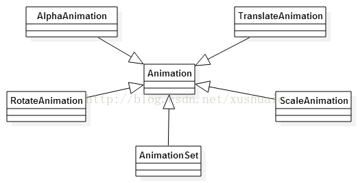
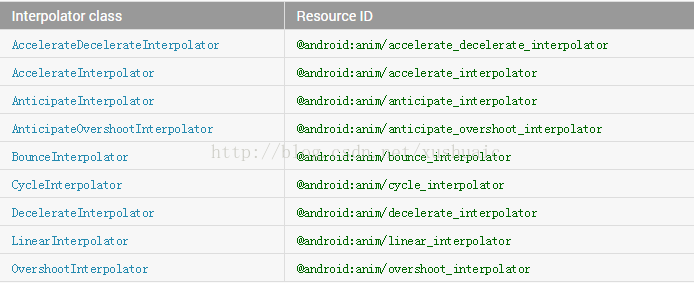
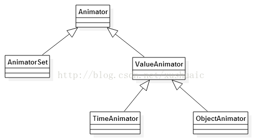

公共技术点之 Android 动画基础
----------------
> 本文为 [Android 开源项目源码解析](https://github.com/android-cn/android-open-project-analysis) 公共技术点中的 Android 动画基础 部分  
 分析者：[lightSky](https://github.com/lightSky)，校对者：[Trinea](https://github.com/Trinea)，校对状态：未完成  

#一  传统 View 动画(Tween/Frame)

## 1.1 Tween 动画##

主要有 4 中：缩放、平移、渐变、旋转

  

文件位置: res/anim/filename.xml  
编译资源的数据类型：an Animation  
资源引用：  
Java: R.anim.filename  
XML: @[package:]anim/filename  
 
```xml
<?xml version="1.0" encoding="utf-8"?>  
    <set xmlns:android="http://schemas.android.com/apk/res/android"  
        android:interpolator="@[package:]anim/interpolator_resource"  
        android:shareInterpolator=["true" | "false"] >  
        <alpha  
        android:fromAlpha="float"  
        android:toAlpha="float" />  
        <scale  
        android:fromXScale="float"  
        android:toXScale="float"  
        android:fromYScale="float"  
        android:toYScale="float"  
        android:pivotX="float"  
        android:pivotY="float" />  
        <translate  
        android:fromXDelta="float"  
        android:toXDelta="float"  
        android:fromYDelta="float"  
        android:toYDelta="float" />  
        <rotate  
        android:fromDegrees="float"  
        android:toDegrees="float"  
        android:pivotX="float"  
        android:pivotY="float" />  
        <set>  
        ...  
        </set>  
    </set>  
```
布局文件必须有一个独立的根元素，可以是 `<alpha>`,` <scale>`, `<translate>`, `<rotate>`, `<set>`（持有一组其它的动画元素，甚至可以是内嵌的 set 元素） 中的一个

### 1.1.1 `<set> `
一个持有其它动画元素的容器 `<alpha>`, `<scale>`, `<translate>`,` <rotate>`或者其它 ``` <set> ``` 元素

属性  
 `android:interpolator `  
应用于动画的插值器。该值必须是一个指定了插值器资源的引用（不是一个插值器的类名），在平台中有缺省的插值器资源可以使用，或者你可以创建自己的插值器资源，可以看下面关于插值器的讨论。  
android:shareInterpolator  
Boolean 值， true：代表在所有的子元素中共享同一个插值器

### 1.1.2  ```<alpha> ```
>A fade-in or fade-out animation. Represents an AlphaAnimation.
一个渐入渐出的动画，对应的 java 类为 AlphaAnimation。

属性  
android:fromAlpha  
android:toAlpha  
代表动画开始和结束时透明度，0.0 表示完全透明，1.0 表示完全不透明，Float 值

### 1.1.3   ```<scale>   ```
可以实现动态调控件尺寸的效果，通过设置 pivotX 和 pivotY 你可以指定 image 缩放的中心点，比如：如果这些值是 0，则表示左上角，所有的缩放变化将沿着右下角的轨迹运动。对应的类为：ScaleAnimation  
属性  
android:fromXScale  
android:toXScale  
android:fromYScale  
android:toYScale  
Float 值，为动画起始到结束时，X、Y 坐标上的伸缩尺寸  
0.0 表示收缩到没有  
1.0 表示正常无伸缩  

android:pivotX  
android:pivotY  
代表缩放的中轴点 X/Y 坐标，浮点值  
如果我们想表示中轴点为图像的中心，我们可以把两个属性值定义成 0.5 或者 50%。

### 1.1.4  ```<translate> ```
代表一个水平、垂直的位移。对应的类为 TranslateAnimation.
属性  
android:fromXDelta  属性代表起始 X 方向的位置  
android:toXDelta  
android:fromYDelta  
android:toYDelta  

代表动画起始或者结束 X / Y 方向上的位置，Float 或者百分比值  
浮点数 num%、num%p 分别相对于自身或者父控件  
如果以浮点数字表示，是一个绝对值，代表相对自身原始位置的像素值；  
如果以 num%表示，代表相对于自己的百分比，比如 toXDelta 定义为 100%就表示在 X 方向上移动自己的 1 倍距离  
如果以 num%p 表示，代表相对于父类组件的百分比。

### 1.1.5  ```<rotate>  ```
是旋转动画，与之对应的 Java 类是 RotateAnimation

属性  
android:fromDegrees  
android:toDegrees  
代表起始和结束的角度，浮点值，单位：度

android:pivotX 属性代表旋转中心的 X 坐标值  
android:pivotY 属性代表旋转中心的 Y 坐标值  
Float 值或者百分比  
这两个属性也有三种表示方式，但是 X 轴都是相对方向都是 Left，Y 轴都是相对于 Top  
浮点数、num%、num%p；  
数字方式代表相对于自身左边缘的像素值，  
num%方式代表相对于自身左边缘或顶边缘的百分比，  
num%p 方式代表相对于父容器的左边缘或顶边缘的百分比  

属性  
android:fromDegrees  
android:toDegrees  
开始和结束时的弧度位置，单位是度，Float 值  

调用代码  

```java 
ImageView image = (ImageView) findViewById(R.id.image);  
Animation hyperspaceJump = AnimationUtils.loadAnimation(this, R.anim.hyperspace_jump); 
image.startAnimation(hyperspaceJump);  
```
另外，在动画中，如果我们添加了 android:fillAfter="true"后，这个动画执行完之后保持最后的状态；android:duration="integer"代表动画持续的时间，单位为毫秒。

### 1.1.6 插值器

用于修改一个动画过程中的速率，可以定义各种各样的非线性变化函数，比如加速、减速等  
在 Android 中所有的插值器都是 Interpolator 的子类，通过 android:interpolator   属性你可以引用不同的插值器。下面是几种插值器:    

 

你可以通过下面的方式使用它们  

```xml
<set android:interpolator="@android:anim/accelerate_interpolator">  
        ...  
</set>  
```
**自定义插值器**
如果你对系统提供的插值器不满意，我们可以创建一个插值器资源修改插值器的属性，比如修改 AnticipateInterpolator 的加速速率，调整 CycleInterpolator 的循环次数等。为了完成这种需求，我们需要创建 XML 资源文件，然后将其放于/res/anim 下，然后再动画元素中引用即可。我们先来看一下几种常见的插值器可调整的属性：  
```
<?xml version="1.0" encoding="utf-8"?>  
    <InterpolatorName xmlns:android="http://schemas.android.com/apk/res/android"  
        android:attribute_name="value"  
 />  
```
我们先来看一下几种常见的插值器可调整的属性：  

 ```<accelerateDecelerateInterpolator>  ``` 无  
 
 ```<accelerateInterpolator> ``` android:factor 浮点值，加速速率，默认为 1  
 
 ```<anticipateInterploator> ``` android:tension 浮点值，起始点后退的张力、拉力数，默认为 2  
 
 ```<anticipateOvershootInterpolator>  ```  android:tension 同上 android:extraTension 浮点值，拉力的倍数，默认为 1.5（2  * 1.5）  
 
 ```<bounceInterpolator>  ``` 无  
 
 ```<cycleInterplolator> ``` android:cycles int，循环的个数，默认为 1  
 
 ```<decelerateInterpolator> ``` android:factor 浮点值，减速的速率，默认为 1  
 
 ```<linearInterpolator>  ``` 无
 
 ```<overshootInterpolator>  ```  浮点值，超出终点后的张力、拉力，默认为 2  

比如：res/anim/my_overshoot_interpolator.xml:  

```xml
<?xml version="1.0" encoding="utf-8"?>  
<overshootInterpolator xmlns:android="http://schemas.android.com/apk/res/android"  
android:tension="7.0"/>  
    This animation XML will apply the interpolator:  
    <scale xmlns:android="http://schemas.android.com/apk/res/android"  
        android:interpolator="@anim/my_overshoot_interpolator"  
        android:fromXScale="1.0"  
        android:toXScale="3.0"  
        android:fromYScale="1.0"  
        android:toYScale="3.0"  
        android:pivotX="50%"  
        android:pivotY="50%"  
        android:duration="700" />  
```
如果简单的修改插值器的属性值还不能够满足我们的需求，那么就自己来通过实现 Interpolator 接口来定义自己的插值器了
因为上面所有的 Interpolator 都实现了 Interpolator 接口，这个接口定义了一个方法：float getInterpolation(float input);
此方法由系统调用，input 代表动画的时间，在 0 和 1 之间，也就是开始和结束之间。  

线性（匀速）插值器定义如下：  
```java
public float getInterpolation(float input) {    
        return input;    
}
```    
加速减速插值器定义如下：  
```java
public float getInterpolation(float input) {    
        return (float)(Math.cos((input + 1) * Math.PI) / 2.0f) + 0.5f;    
}    
```
## 1.2 Frame 动画

文件目录：res/drawable/filename.xml  
编译资源数据类型 AnimationDrawable  
资源引用：  
Java: R.drawable.filename  
XML: @[package:]drawable.filename  

```xml
<?xml version="1.0" encoding="utf-8"?>  
<animation-list xmlns:android="http://schemas.android.com/apk/res/android"  
   android:oneshot=["true" | "false"] >  
    <item  
        android:drawable="@[package:]drawable/drawable_resource_name"  
        android:duration="integer" />  
</animation-list>  
```

### 1.2.1 `<animation-list>`
 必须作为根元素，包含一个或者多个根元素  
属性：android:oneshot ：true：只执行一次动画，false：循环执行  

### 1.2.2  ```<item> ```
>A single frame of animation. Must be a child of a  ```<animation-list> ``` element.
一帧独立动画，必须是 ```<animation-list> ```的子元素  

属性  
android:drawable  
Drawable 资源，用于这一帧的图片  
android:duration  
Integer 类型.该帧的时长，单位为毫秒 milliseconds.  

res/anim/rocket.xml:    

```xml        
<?xml version="1.0" encoding="utf-8"?>  
        <animation-list xmlns:android="http://schemas.android.com/apk/res/android"  
            android:oneshot="false">  
            <item android:drawable="@drawable/rocket_thrust1" android:duration="200" />  
            <item android:drawable="@drawable/rocket_thrust2" android:duration="200" />  
            <item android:drawable="@drawable/rocket_thrust3" android:duration="200" />  
        </animation-list>  
```
调用代码  

```java
ImageView rocketImage = (ImageView) findViewById(R.id.rocket_image);  
rocketImage.setBackgroundResource(R.drawable.rocket_thrust);  
rocketAnimation = (AnimationDrawable) rocketImage.getBackground();  
rocketAnimation.start();
```


#  二. Property Animation


##2.1 Property Animation 的工作方式

Property Animation 动画有两个步聚：  
1.计算属性值  
2.为目标对象的属性设置属性值，即应用和刷新动画  


###2.1.1 计算属性值


**过程一：计算已完成动画分数 elapsed fraction**
为了执行一个动画，你需要创建一个 ValueAnimator，并且指定目标对象属性的开始、结束值和持续时间。在调用 start 后的整个动画过程中， ValueAnimator 会根据已经完成的动画时间计算得到一个 0 到 1 之间的分数，代表该动画的已完成动画百分比。0 表示 0%，1 表示 100%。

**过程二：计算插值（动画变化率）interpolated fraction**
当 ValueAnimator 计算完已完成动画分数后，它会调用当前设置的 TimeInterpolator，去计算得到一个 interpolated（插值）分数，在计算过程中，已完成动画百分比会被加入到新的插值计算中。

**过程三：计算属性值**
当插值分数计算完成后，ValueAnimator 会根据插值分数调用合适的 TypeEvaluator 去计算运动中的属性值。  
以上分析引入了两个概念：已完成动画分数（elapsed fraction）、插值分数( interpolated fraction )。

## 2.2 核心类

 

###2.2.1 Interpolators

插值器：时间的函数，定义了动画的变化律。  
插值器只需实现一个方法：`getInterpolation(float input)`,其作用就是把 0 到 1 的 elapsed   fraction 变化映射到另一个 interpolated fraction。  Interpolator 接口的直接继承自`TimeInterpolator`，内部没有任何方法，而`TimeInterpolator`只有一个`getInterpolation`方法，所以所有的插值器只需实现`getInterpolation`方法即可。  
传入参数是正常执行动画的时间点，返回值是调用者真正想要它执行的时间点。传入参数是{0,1}，返回值一般也是{0,1}。{0,1}表示整段动画的过程。中间的 0.2、0.3 等小数表示在整个动画（原本是匀速的）中的位置，其实就是一个比值。如果返回值是负数，会沿着相反的方向执行。如果返回的是大于 1，会超出正方向执行。也就是说，动画可能在你指定的值上下波动，大多数情况下是在指定值的范围内。  
`getInterpolation(float input)`改变了默认动画的时间点 elapsed fraction，根据时间点 interpolated fraction 得到的是与默认时间点不同的属性值，插值器的原理就是通过改变实际执行动画的时间点，提前或延迟默认动画的时间点来达到加速/减速的效果。动画插值器目前都只是对动画执行过程的时间进行修饰，并没有对轨迹进行修饰。  

简单点解释这个方法，就是当要执行 input 的时间时，通过 Interpolator 计算返回另外一个时间点，让系统执行另外一个时间的动画效果。

### 2.2.2 Evaluators

Evaluators 告诉属性动画系统如何去计算一个属性值。它们通过 Animator 提供的动画的起始和结束值去计算一个动画的属性值。
属性系统提供了以下几种 Evaluators：
1.IntEvaluator  
2.FloatEvaluator  
3.ArgbEvaluator  
这三个由系统提供，分别用于计算 int，float，color 型（十六进制）属性的计算器  
4.TypeEvaluator  
一个用于用户自定义计算器的接口，如果你的对象属性值类型，不是 int，float，或者 color 类型，你必须实现这个接口，去定义自己的数据类型。  

`TypeEvaluator`接口只有一个方法，就是`evaluate()`方法，它允许你使用的 animator 返回一个当前动画点的属性值。

**TimeInterpolator 和 TypeEvaluator 的区别**  
首先明确动画属性值的计算包括三步，其中第二步和第三步分别需要借助`TimeInterpolator`和`TypeEvluator`完成。

`TypeEvaluator`所做的是根据数据结构计算最终的属性值，允许你定义自己的数据结构，这是官方对它的真正定义，如果你所定义的属性值的数据类型不是 float、int、color 类型，那么你需要实现 TypeEvaluator 接口的`evaluate()`方法，自己进行属性值的计算  

`Interpolator`更倾向于你定义一种运动的变化率，比如匀速、加速、减速等，官方对 Interpolator 的定义也确实是这样的：
>A time interpolator defines the rate of change of an >animation. This allows animations to have non-linear >motion, such as acceleration and deceleration.  

对于自定义高级动画时，弄清`TimeInterpolator`和`TypeEvaluator`非常重要，如果你希望要自定义自己的动画，那么这两个函数肯定是关键部分，一个是定义动画变化率，一个是定义数据结构和属性值计算方式，两者共同决定了一个动画的运动。  

### 2.2.3 ValueAnimator

属性动画中的主要的时序引擎，如动画时间，开始、结束属性值，相应时间属性值计算方法等。包含了所有计算动画值的核心函数。也包含了每一个动画时间上的细节，信息，一个动画是否重复，是否监听更新事件等，并且还可以设置自定义的计算类型。  

使用 ValueAnimator 实现动画需要手动更新：  
```java 
ValueAnimator animation = ValueAnimator.ofFloat(0f, 1f);
animation.setDuration(1000);
animation.addUpdateListener(new AnimatorUpdateListener() {
@Override
public void onAnimationUpdate(ValueAnimator animation) {
        Log.i("update", ((Float) animation.getAnimatedValue()).toString());
      }
});
animation.setInterpolator(new CycleInterpolator(3));
animation.start();
```

###2.2.4 ObjectAnimator
继承自`ValueAnimator`，允许你指定要进行动画的对象以及该对象的一个属性。该类会根据计算得到的新值自动更新属性。也就是说上 Property Animation 的两个步骤都实现了。大多数的情况，你使用`ObjectAnimator`就足够了，因为它使得目标对象动画值的处理过程变得简单，不用再向`ValueAnimator`那样自己写动画更新的逻辑。但`ObjectAnimator`有一定的限制，比如它需要目标对象的属性提供指定的处理方法，这个时候你需要根据自己的需求在`ObjectAnimator`和`ValueAnimator`中做个选择了，看哪种实现更简便。  

`ObjectAnimator`的自动更新功能，依赖于属性身上的`setter`和`getter`方法，所以为了让`ObjectAnimator`能够正确的更新属性值，你必须遵从以下规范:  

1. 该对象的属性必须有`get`和`set`方法（方法的格式必须是驼峰式），方法格式为 set<propertyName>()，因为 ObjectAnimator 会自动更新属性，它必须能够访问到属性的`setter`方法，比如属性名为`foo`,你就需要一个`setFoo()`方法，如果 setter 方法不存在，你有三种选择：  
a.添加 setter 方法  
b.使用包装类。通过该包装类通过一个有效的 setter 方法获取或者改变属性值的方法，然后应用于原始对象，比如 NOA 的`AnimatorProxy`。  
c.使用 ValueAnimator 代替  

（这 3 点的意思总结起来就是一定要有一个`setter`方法，让`ObjectAnimator`能够访问到）  

2. 如果你为 ObjectAnimator 的工厂方法的可变参数只传递了一个值，那么会被作为动画的结束值。  

3. 注意，属性的`getter`方法和`setter`方法必须必须是相对应的，比如你构造了一个如下的`ObjectAnimator`，那么`getter`和`setter`方法就应该为：  
```
targetObject.setPropName(float) 和 targetObject.getPropName(float) :
ObjectAnimator.ofFloat(targetObject, "propName", 1f)
```
4. 根据动画的目标属性或者对象不同，你可能需要调用某一个 View 的`invalidate`方法，根据新的动画值去强制屏幕重绘该 View。可以在`onAnimateonUpdate()`回调方法中去做。比如，对一个 Drawable 的颜色属性进行动画，只有当对象重绘自身的时候，才会导致该属性的更新，（不像平移或者缩放那样是实时的）。一个 View 的所有 setter 属性方法，比如`setAlpha()`和`setTranslationX()`都可以适当的更新 View。因此你不需要在重绘的时候为这些方法传递新的值。更多关于 Listener 的信息，可以参考第四部分 Animation Listeners。  

**简单总结下：**
当你不希望向外暴露`Setter`方法的时候，或者希望获取到动画值统一做处理的话，亦或只需要一个简单的时序机制(拥有动画的各种值)的话，那么你可以选择使用`ValueAnimator`，它更简单。如果你就是希望更新动画，为了简便，可以使用`ObjectAnimator`，但自定义的属性必须有`setter`和`getter`方法，并且它们必须都是标准的驼峰式（确保内部能够调用），必须有结束值。你可以实现`Animator.AnimatorListener`接口根据自己的需求去更新 View。  


###2.2.5 AnimatorSet
提供组合动画能力的类。并可设置组中动画的时序关系，如同时播放、有序播放或延迟播放。`Elevator`会告诉属性动画系统如何计算一个属性的值，它们会从`Animator`类中获取时序数据，比如开始和结束值，并依据这些数据计算动画的属性值。  

**小结：**
`TypeEvaluator`   
定义了属性值的计算方式，有 int,float,color 类型，根据属性的开始、结束值和插值一起计算出当前时间的属性值，终极方法，整个动画属性值计算过程的结尾。  

`TimeInterpolation`  
插值器都必须实现的接口，定义了动画的变化率，如线性，非线性。

`ValueAnimator`与`ObjectAnimator`：  
两者都可以进行属性动画，但是`ObjectAnimator`更加简单，不用去做更新属性值的计算，但是必须要提供标准的`setter`和`getter`方法，让`ObjectAnimator`能够获取和更新属性值。


### 2.2.6 ViewPropertyAnimator

可以方便的为某个 View 的多个属性添加并行的动画，只使用一个`ViewPropertyAnimator`对象就可以完成。它的行为更像一个`ObjectAnimator`，因为它修改的是对象的实际属性值。但它为一次性给多个属性添加动画提供了方便，而且使用`ViewPropertyAnimator`的代码更连贯更易读。  
下面的代码段分别展示了使用多个`ObjectAnimator`对象、一个`ObjectAnimator`对象、 `ViewPropertyAnimator`同时为一个 View 的 X 和 Y 属性添加动画的示例：  

**多个 ObjectAnimator 结合 AnimatorSet 实现**  
```java
ObjectAnimator animX = ObjectAnimator.ofFloat(myView, "x", 50f);
ObjectAnimator animY = ObjectAnimator.ofFloat(myView, "y", 100f);
AnimatorSet animSetXY = new AnimatorSet();
animSetXY.playTogether(animX, animY);
animSetXY.start();
```

**一个 ObjectAnimator 结合多个 PropertyValuesHolder 实现**  
```java
PropertyValuesHolder pvhX = PropertyValuesHolder.ofFloat("x", 50f);
PropertyValuesHolder pvhY = PropertyValuesHolder.ofFloat("y", 100f);
ObjectAnimator.ofPropertyValuesHolder(myView, pvhX, pvyY).start();
```
**ViewPropertyAnimator: 只需一行代码**  

`myView.animate().x(50f).y(100f);//myView.animate()直接返回一个 ViewPropertyAnimator 对象`


### 2.2.7 PropertyValuesHolder
顾名思义，该类持有属性，相关属性值的操作以及属性的 setter，getter 方法的创建，属性值以 Keyframe 来承载，最终由 KeyframeSet 统一处理。


### 2.2.8 KeyFrame

一个`keyframe`对象由一对 time / value 的键值对组成，可以为动画定义某一特定时间的特定状态。  
每个`keyframe`可以拥有自己的插值器，用于控制前一帧和当前帧的时间间隔间内的动画。  

`Keyframe.ofFloat(0f,0f);`
第一个参数为：要执行该帧动画的时间节点（elapsed time / duration）  
第二个参数为属性值。  
因此如果你想指定某一特定时间的特定状态，那么简单的使用 Object`Animator`就满足不了你了，因为，`ObjectAnimator.ofInt(....)`类似的工厂方法，无法指定特定的时间点的状态。

**每个 KeyFrame 的 Interpolator**  
每个`KeyFrame`其实也有个`Interpolator`。如果没有设置，默认是线性的。之前为`Animator`设置的`Interpolator`是整个动画的，而系统允许你为每一`KeyFrame`的单独定义`Interpolator`，系统这样做的目的是允许你在某一个`keyFrame`做特殊的处理，也就是整体上是按照你的插值函数来计算，但是，如果你希望某个或某些`KeyFrame`会有不同的动画表现，那么你可以为这个`keyFrame`设置`Interpolator`。  

**因此，Keyframe 的定制性更高，你如果想精确控制某一个时间点的动画值及其运动规律，你可以自己创建特定的 Keyframe**  

**Keyframe 使用**  
为了实例化一个`keyframe`对象，你必须使用某一个工厂方法：ofInt(), ofFloat(), or ofObject() 去获取合适的`keyframe`类型，然后你调用`ofKeyframe`工厂方法去获取一个`PropertyValuesHolder`对象，一旦你拥有了该对象，你可以将 PropertyValuesHolder 作为参数获取一个`Animator`，如下：  
```java
Keyframe kf0 = Keyframe.ofFloat(0f, 0f);
Keyframe kf1 = Keyframe.ofFloat(.5f, 360f);
Keyframe kf2 = Keyframe.ofFloat(1f, 0f);
PropertyValuesHolder pvhRotation = PropertyValuesHolder.ofKeyframe("rotation", kf0, kf1, kf2);//动画属性名，可变参数
ObjectAnimator rotationAnim = ObjectAnimator.ofPropertyValuesHolder(target, pvhRotation)
rotationAnim.setDuration(5000);
```
### 2.2.9 KeyFrameSet
根据 Animator 传入的值，为当前动画创建一个特定类型的 KeyFrame 集合。  
通常通过 ObjectAnimator.ofFloat(...)进行赋值时，这些值其实是通过一个 KeyFrameSet 来维护的  
比如：
```java
ObjectAnimator.ofFloat(target, "translateX", 50, 100, 200); 
```
调用者传入的 values 为 50,100,200，则 numKeyframs = 3，那么创建出相应的 Keyframe 为：
Keyframe(0,50)，Keyframe(1/2,100)，Keyframe(1,200), 时间点 0，1/2，1 都是按比例划分的    

```java
    public static KeyframeSet ofFloat(float... values) {
        int numKeyframes = values.length;
        FloatKeyframe keyframes[] = new FloatKeyframe[Math.max(numKeyframes,2)];
        if (numKeyframes == 1) {
            keyframes[0] = (FloatKeyframe) Keyframe.ofFloat(0f);
            keyframes[1] = (FloatKeyframe) Keyframe.ofFloat(1f, values[0]);
        } else {
            keyframes[0] = (FloatKeyframe) Keyframe.ofFloat(0f, values[0]);
            for (int i = 1; i < numKeyframes; ++i) {
                keyframes[i] = (FloatKeyframe) Keyframe.ofFloat((float) i / (numKeyframes - 1), values[i]);//这里是关键
            }
        }
        return new FloatKeyframeSet(keyframes);
    }
```


## 2.3 在 XML 中声明属性动画

通过在 XML 中定义的动画，可以很方便的在多个 Activities 中重用而且更容易编辑，复用性强。为了区分新的属性动画，从 3.1 开始，你应`res/animator/`下存放属性动画的资源文件，使用`animator`文件夹是可选的，但是如果你想在 Eclipse ADT 插件中使用布局编辑工具（ADT 11.0.0+），就必须在`res/animator`文件夹下存放了，因为 ADT 只会查找`res/animator`文件夹下的属性动画资源文件。

**属性动画支持的 Tag 有**  
ValueAnimator - `<animator>`  
ObjectAnimator - `<objectAnimator>`  
AnimatorSet - `<set>`  
```xml
<set android:ordering="sequentially">
    <set>
        <objectAnimator
            android:propertyName="x"
            android:duration="500"
            android:valueTo="400"
            android:valueType="intType"/>
        <objectAnimator
            android:propertyName="y"
            android:duration="500"
            android:valueTo="300"
            android:valueType="intType"/>
    </set>
    <objectAnimator
        android:propertyName="alpha"
        android:duration="500"
        android:valueTo="1f"/>
</set>
```
```java
AnimatorSet set = (AnimatorSet) AnimatorInflater.loadAnimator(myContext,
    R.anim.property_animator);
set.setTarget(myObject);
set.start();
```

**目录**
res/animator/filename.xm  

**编译后的资源为**  
`ValueAnimator`, `ObjectAnimator`, or `AnimatorSet`　 

XML 文件的根元素必须为`<set>`,` <objectAnimator>`, or `<valueAnimator>`之一。也可以在一个 set 中组织不同的动画，包含其它`<set>`元素,也就是说，可以嵌套。

```xml
<set  
  android:ordering=["together" | "sequentially"]>  
  
    <objectAnimator  
        android:propertyName="string"  
        android:duration="int"  
        android:valueFrom="float | int | color"  
        android:valueTo="float | int | color"  
        android:startOffset="int"  
        android:repeatCount="int"  
        android:repeatMode=["repeat" | "reverse"]  
        android:valueType=["intType" | "floatType"]/>  
  
    <animator  
        android:duration="int"  
        android:valueFrom="float | int | color"  
        android:valueTo="float | int | color"  
        android:startOffset="int"  
        android:repeatCount="int"  
        android:repeatMode=["repeat" | "reverse"]  
        android:valueType=["intType" | "floatType"]/>  
  
    <set>  
        ...  
    </set>  
</set>  
```

### 2.3.2 元素介绍  

### 2.3.2.1 `<set>`  
动画集合节点，有一个属性 ordering，表示它的子动画启动方式是先后有序的还是同时。

属性  
sequentially：动画按照先后顺序  
together (default) ：动画同时启动  

### 2.3.2.2 `<objectAnimator>`
一个对象的一个属性，相应的 Java 类为:`ObjectAnimator`  

属性  
android:propertyName：  
String 类型，必须要设定的值，代表要执行动画的属性，通过名字引用，比如你可以指定了一个 View 的"alpha" 或者 "backgroundColor" ，这个 objectAnimator 元素没有暴露 target 属性，因此不能够在 XML 中执行一个动画，必须通过调用`loadAnimator()` 填充你的 XML 动画资源，并且调用`setTarget()` 应用到拥有这个属性的目标对象上。

`android:valueTo`  
Float、int 或者 color，也是必须值，表明了动画结束的点，颜色由 6 位十六进制的数字表示。  

`android:valueFrom`  
相对应 valueTo，动画的起始点，如果没有指定，系统会通过属性身上的 get 方法获取 ，颜色也是 6 位十六进制的数字表示。  

`android:duration`  
动画的时长，int 类型，以毫秒为单位，默认为 300 毫秒。  

`android:startOffset`  
动画延迟的时间，从调用 start 方法后开始计算，int 型，毫秒为单位，  

`android:repeatCount`  
一个动画的重复次数，int 型，”-1“表示无限循环，”1“表示动画在第一次执行完成后重复执行一次，也就是两次，默认为 0，不重复执行。  

`android:repeatMode`  
重复模式：int 型，当一个动画执行完的时候应该如何处理。该值必须是正数或者是 -1，  
“reverse”  
会使得按照动画向相反的方向执行，可实现类似钟摆效果。  
“repeat”  
会使得动画每次都从头开始循环。  

`android:valueType`  
关键参数，如果该 value 是一个颜色，那么就不需要指定，因为动画框架会自动的处理颜色值。有 intType 和 floatType 两种：分别说明动画值为 int 和 float 型。  

### 2.3.2.3 `<animator>`

在一个特定的时间里执行一个动画。相对应的是 ValueAnimator.所有的属性和<objectAnimator>一样
android:valueTo  
android:valueFrom  
android:duration  
android:startOffset  
android:repeatCount  
android:repeatMode  
android:valueType  
Value Description  
floatType (default)  

res/animator/property_animator.xml:  
```xml
<set android:ordering="sequentially">  
    <set>  
        <objectAnimator  
            android:propertyName="x"  
            android:duration="500"  
            android:valueTo="400"  
            android:valueType="intType"/>  
        <objectAnimator  
            android:propertyName="y"  
            android:duration="500"  
            android:valueTo="300"  
            android:valueType="intType"/>  
    </set>  
    <objectAnimator  
        android:propertyName="alpha"  
        android:duration="500"  
        android:valueTo="1f"/>  
</set>  
```

为了执行该动画，必须在代码中将该动画资源文件填充为一个 AnimationSet 对象，然后在执行动画前，为目标对象设置所有的动画集合。  
简便的方法就是通过 setTarget 方法为目标对象设置动画集合，代码如下：  
```java
AnimatorSet set = (AnimatorSet) AnimatorInflater.loadAnimator(myContext,  
   R.anim.property_animator);  
set.setTarget(myObject);  
set.start();  
```

#三 View anim 与 property anim 的比较

####View anim 系统
view animation system 提供的能力只能够为 View 添加动画。因此如果你想为非 View 对象添加动画，就必须自己去实现，
view animation system 在 View 动画的展现方面也是有约束的，只暴露了 View 的很少方面。比如 View 支持缩放和旋转，但不支持背景颜色的动画。  
view animation system 的另一劣势是，其改变的是 View 的绘制效果，真正的 View 的属性保持不变，比如无论你在对话中如何缩放 Button 的大小，Button 的有效点击区域还是没有应用到动画时的区域，其位置与大小都不变。  
但是 View animation system 只需花费很少时间创建而且只需很少的代码。如果 View 动画完成了你所有的动作，或者你存在的代码已经达到了你想要的效果，就没必要使用 property 动画系统了。

####property anim 系统
完全弥补了 View anim System 的缺陷，你可以为一个对象的任何属性添加动画，（View 或者非 View），同时对象自己也会被修改。
并且当属性变化的时候，property Anim 系统会自动的刷新屏幕。  
属性动画系统在处理动画方面也更加强劲。更高级的，你可以指定动画的属性，比如颜色，位置，大小，定义动画的插值器并且同步多个动画。  
并且在 Property Animation 中，改变的是对象的实际属性，如 Button 的缩放，Button 的位置与大小属性值都改变了。而且 Property Animation 不止可以应用于 View，还可以应用于任何对象。

平时使用的简单动画特效，使用 View 动画就可以满足，但是如果你想做的更加复杂，比如背景色的动画，或者不仅是 View，还希望对其它对象添加动画等，那么你就得考虑使用 Property 动画了。  

更多动画开源库及使用，可以参考个人博客：[Android 动画系列](http://www.lightskystreet.com/categories/Android/Android%E5%8A%A8%E7%94%BB/)，其中介绍了一些基本使用，也提到了一些 GitHub 上的动画开源库，可以作为 Android 动画学习的资料  

参考文献：  
http://developer.android.com/guide/topics/resources/animation-resource.html#val-animator-element  
http://blog.csdn.net/liuhe688/article/details/6660823  
http://developer.android.com/guide/topics/resources/animation-resource.html#Property  
http://developer.android.com/guide/topics/graphics/prop-animation.html  
http://android-developers.blogspot.jp/2011/02/animation-in-honeycomb.html  
http://www.cnblogs.com/angeldevil/archive/2011/12/02/2271096.html  
http://cogitolearning.co.uk/?p=1078  
http://www.2cto.com/kf/201306/222725.html  
http://my.oschina.net/banxi/blog/135633  
http://zhouyunan2010.iteye.com/blog/1972789  
http://blog.csdn.net/guolin_blog/article/details/43816093
