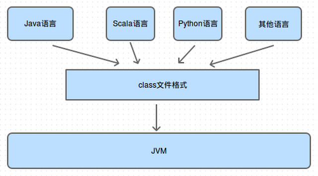

# 公共技术之 Java反射 Reflection 

## 1. 了解Java中的反射
### 1.1 什么是Java的反射
   Java反射是可以让我们在运行时获取类的函数、字段、父类、接口等Class内部信息的机制。通过反射还可以让我们在运行期实例化对象，调用方法，通过调用get/set方法获取变量的值,即使方法或字段是私有的的也可以通过反射的形式调用,这种“看透class”的能力被称为内省,这种能力在框架开发中尤为重要。
   有些情况下,我们要使用的类在运行时才会确定,这个时候我们不能在编译期就使用它,因此只能通过反射的形式来使用在运行时才存在的类(该类符合某种特定的规范,例如JDBC),这是反射用得比较多的场景。    
   还有一个比较常见的场景就是编译时我们对于类的内部信息不可知,必须得到运行时才能获取类的具体信息。比如ORM框架,在运行时才能够获取类中的各个字段,然后通过反射的形式获取其字段名和值,存入数据库。这也是反射比较经典应用场景之一。  

## 1.2 Class类
   那么既然反射是操作Class信息的,Class又是什么呢?    
     
   当我们编写完一个Java项目之后,所有的Java文件都会被编译成一个.class文件，这些Class对象承载了这个类型的父类、接口、构造函数、方法、字段等原始信息，这些class文件在程序运行时会被ClassLoader加载到虚拟机中。当一个类被加载以后，Java虚拟机就会在内存中自动产生一个Class对象。我们通过new的形式创建对象实际上就是通过这些Class来创建,只是这个过程对于我们是不透明的而已。      
   下面的章节中我们会为大家演示反射的一些常用api,从代码的角度理解反射。        


## 2. 反射Class以及构造对象
### 2.1 获取Class对象   
   在你想检查一个类的信息之前，你首先需要获取类的Class对象。Java中的所有类型包括基本类型,即使是数组都有与之关联的Class类的对象。如果你在编译期知道一个类的名字的话，那么你可以使用如下的方式获取一个类的Class对象。

```
Class<?> myObjectClass = MyObject.class;
```     

   如果你已经得到了某个对象,但是你想获取这个对象的Class对象,那么你可以通过下面的方法得到:
   
```
Student me = new Student("mr.simple");
Class<?> clazz = me.getClass();
```         

   如果你在编译期获取不到目标类型,但是你知道它的完整类路径,那么你可以通过如下的形式来获取Class对象:

```  
Class<?> myObjectClass = Class.forName("com.simple.User");
```     

在使用Class.forName()方法时，你必须提供一个类的全名，这个全名包括类所在的包的名字。例如User类位于com.simple包，那么他的完整类路径就是com.simple.User。     
如果在调用Class.forName()方法时，没有在编译路径下(classpath)找到对应的类，那么将会抛出ClassNotFoundException。     

**接口说明**     

```
// 加载指定的Class对象,参数1为要加载的类的完整路径,例如"com.simple.Student". ( 常用方式 )
public static Class<?> forName (String className)

// 加载指定的Class对象,参数1为要加载的类的完整路径,例如"com.simple.Student";
// 参数2为是否要初始化该Class对象,参数3为指定加载该类的ClassLoader.
public static Class<?> forName (String className, boolean shouldInitialize, ClassLoader classLoader)

```   

	
### 2.2 通过Class对象构造目标类型的对象	
   一旦你拿到Class对象之后,你就可以为所欲为了！当你善用它的时候它就是神兵利器,当你心怀鬼胎之时它就会变成恶魔。但获取Class对象只是第一步,我们需要在执行那些强大的行为之前通过Class对象构造出该类型的对象,然后才能通过该对象释放它的能量。
	我们知道,在java中药构造对象,必须通过该类的构造函数,那么其实反射也是一样一样的。但是它们确实有区别的,通过反射构造对象,我们首先要获取类的Constructor(构造器)对象,然后通过Constructor来创建目标类的对象。还是直接上代码的。     
	
```
    private static void classForName() {
        try {
        	// 获取Class对象
            Class<?> clz = Class.forName("org.java.advance.reflect.Student");
            // 通过Class对象获取Constructor,Student的构造函数有一个字符串参数,
            // 因此这里需要传递参数的类型 ( Student类见后面的代码 )
            Constructor<?> constructor = clz.getConstructor(String.class);
            // 通过Constructor来创建Student对象
            Object obj = constructor.newInstance("mr.simple");
            System.out.println(" obj :  " + obj.toString());
        } catch (Exception e) {
            e.printStackTrace();
        }
    }
``` 	
   通过上述代码,我们就可以在运行时通过完整的类名来构建对象。      
   
**获取构造函数接口**        

```  
// 获取一个公有的构造函数,参数为可变参数,如果构造函数有参数,那么需要将参数的类型传递给getConstructor方法
public Constructor<T> getConstructor (Class...<?> parameterTypes)
// 获取目标类所有的公有构造函数
public Constructor[]<?> getConstructors ()

```   
 注意,当你通过反射获取到Constructor、Method、Field后,在反射调用之前将此对象的 accessible 标志设置为true,以此来提升反射速度。值为 true 则指示反射的对象在使用时应该取消 Java 语言访问检查。值为 false 则指示反射的对象应该实施 Java 语言访问检查。例如 :     
```
   Constructor<?> constructor = clz.getConstructor(String.class);
   // 设置Constructor的Accessible
   constructor.setAccessible(true);

   // 设置Methohd的Accessible
   Method learnMethod = Student.class.getMethod("learn", String.class);
   learnMethod.setAccessible(true);
```    
   由于后面还会用到Student以及相关的类,我们在这里就先给出它们的代码吧。      
**Person.java**     
       
```
public class Person {
    String mName;

    public Person(String aName) {
        mName = aName;
    }

    private void sayHello(String friendName) {
        System.out.println(mName + " say hello to " + friendName);
    }

    protected void showMyName() {
        System.out.println("My name is " + mName);
    }

    public void breathe() {
		System.out.println(" take breathe ");
    }
}
```        

**Student.java**    

```
public class Student extends Person implements Examination {
    // 年级
    int mGrade;

    public Student(String aName) {
        super(aName);
    }

    public Student(int grade, String aName) {
        super(aName);
        mGrade = grade;
    }

    private void learn(String course) {
        System.out.println(mName + " learn " + course);
    }

    public void takeAnExamination() {
		System.out.println(" takeAnExamination ");
    }

    public String toString() {
        return " Student :  " + mName;
    }
```   

**Breathe.java**   

```
// 呼吸接口
public interface Breathe {
    public void breathe();
}
```


**Examination.java**   

```
// 考试接口
public interface Examination {
    public void takeAnExamination();
}
```


## 3 反射获取类中函数

### 3.1 获取当前类中定义的方法
   要获取当前类中定义的所有方法可以通过Class中的getDeclaredMethods函数,它会获取到当前类中的public、default、protected、private的所有方法。而getDeclaredMethod(String name,Class...<?> parameterTypes)则是获取某个指定的方法。代码示例如下 :  

``` 
 private static void showDeclaredMethods() {
      Student student = new Student("mr.simple");
        Method[] methods = student.getClass().getDeclaredMethods();
        for (Method method : methods) {
            System.out.println("declared method name : " + method.getName());
        }

        try {
            Method learnMethod = student.getClass().getDeclaredMethod("learn", String.class);
            // 获取方法的参数类型列表
            Class<?>[] paramClasses = learnMethod.getParameterTypes() ;
            for (Class<?> class1 : paramClasses) {
                System.out.println("learn 方法的参数类型 : " + class1.getName());
            }
            // 是否是private函数,字段是否是private也可以使用这种方式判断
            System.out.println(learnMethod.getName() + " is private "
                    + Modifier.isPrivate(learnMethod.getModifiers()));
            learnMethod.invoke(student, "java ---> ");
        } catch (Exception e) {
            e.printStackTrace();
        }
    }
```    


### 3.2 获取当前类、父类中定义的公有方法      
   要获取当前类以及父类中的所有public方法可以通过Class中的getMethods函数,而getMethod则是获取某个指定的方法。代码示例如下 :  

``` 
    private static void showMethods() {
        Student student = new Student("mr.simple");
        // 获取所有方法
        Method[] methods = student.getClass().getMethods();
        for (Method method : methods) {
            System.out.println("method name : " + method.getName());
        }

        try {
            // 通过getMethod只能获取公有方法,如果获取私有方法则会抛出异常,比如这里就会抛异常
            Method learnMethod = student.getClass().getMethod("learn", String.class);
            // 是否是private函数,字段是否是private也可以使用这种方式判断
            System.out.println(learnMethod.getName() + " is private " + Modifier.isPrivate(learnMethod.getModifiers()));
            // 调用learn函数
            learnMethod.invoke(student, "java");
        } catch (Exception e) {
            e.printStackTrace();
        }
    }
```    


**接口说明**

```
// 获取Class对象中指定函数名和参数的函数,参数一为函数名,参数2为参数类型列表
public Method getDeclaredMethod (String name, Class...<?> parameterTypes)

// 获取该Class对象中的所有函数( 不包含从父类继承的函数 )
public Method[] getDeclaredMethods ()

// 获取指定的Class对象中的**公有**函数,参数一为函数名,参数2为参数类型列表
public Method getMethod (String name, Class...<?> parameterTypes)

// 获取该Class对象中的所有**公有**函数 ( 包含从父类和接口类集成下来的函数 )
public Method[] getMethods ()

```      
   这里需要注意的是getDeclaredMethod和getDeclaredMethods包含private、protected、default、public的函数,并且通过这两个函数获取到的只是在自身中定义的函数,从父类中集成的函数不能够获取到。而getMethod和getMethods只包含public函数,父类中的公有函数也能够获取到。           
   

## 4 反射获取类中的字段
   获取字段和章节3中获取方法是非常相似的,只是从getMethod函数换成了getField,从getDeclaredMethod换成了getDeclaredField罢了。      

### 4.1 获取当前类中定义的字段
   要获取当前类中定义的所有字段可以通过Class中的getDeclaredMethods函数,它会获取到当前类中的public、default、protected、private的所有方法。而getDeclaredMethods则是获取某个指定的方法。代码示例如下 :  

``` 
    private static void showDeclaredFields() {
        Student student = new Student("mr.simple");
        // 获取当前类和父类的所有公有字段
        Field[] publicFields = student.getClass().getDeclaredFields();
        for (Field field : publicFields) {
            System.out.println("declared field name : " + field.getName());
        }

        try {
            // 获取当前类和父类的某个公有字段
            Field gradeField = student.getClass().getDeclaredField("mGrade");
            // 获取属性值
            System.out.println(" my grade is : " + gradeField.getInt(student));
            // 设置属性值
            gradeField.set(student, 10);
            System.out.println(" my grade is : " + gradeField.getInt(student));
        } catch (Exception e) {
            e.printStackTrace();
        }
    }
```    


### 4.2 获取当前类、父类中定义的公有字段      
   要获取当前类以及父类中的所有public字段可以通过Class中的getFields函数,而getField则是获取某个指定的字段。代码示例如下 :  

``` 
    private static void showFields() {
        Student student = new Student("mr.simple");
        // 获取当前类和父类的所有公有字段
        Field[] publicFields = student.getClass().getFields();
        for (Field field : publicFields) {
            System.out.println("field name : " + field.getName());
        }

        try {
            // 获取当前类和父类的某个公有字段
            Field ageField = student.getClass().getField("mAge");
            System.out.println(" age is : " + ageField.getInt(student));
        } catch (Exception e) {
            e.printStackTrace();
        }
    }
```    


**接口说明**

```
// 获取Class对象中指定字段名的字段,参数一为字段名
public Method getDeclaredField (String name)

// 获取该Class对象中的所有字段( 不包含从父类继承的字段 )
public Method[] getDeclaredFields ()

// 获取指定的Class对象中的**公有**字段,参数一为字段名
public Method getField (String name)

// 获取该Class对象中的所有**公有**字段 ( 包含从父类和接口类集成下来的公有字段 )
public Method[] getFields ()

```      
   这里需要注意的是getDeclaredMethod和getDeclaredMethods包含private、protected、default、public的函数,并且通过这两个函数获取到的只是在自身中定义的函数,从父类中集成的函数不能够获取到。而getMethod和getMethods只包含public函数,父类中的公有函数也能够获取到。 


## 5 反射获取父类与接口
### 5.1 获取父类
获取Class对象的父类。

```
    Student student = new Student("mr.simple");
    Class<?> superClass = student.getClass().getSuperclass();
    while (superClass != null) {
        System.out.println("Student's super class is : " + superClass.getName());
        // 再获取父类的上一层父类,直到最后的Object类,Object的父类为null
        superClass = superClass.getSuperclass();
    }
```             


### 5.2 获取接口    
   获取Class对象中实现的接口。

```
    private static void showInterfaces() {
        Student student = new Student("mr.simple");
        Class<?>[] interfaceses = student.getClass().getInterfaces();
        for (Class<?> class1 : interfaceses) {
            System.out.println("Student's interface is : " + class1.getName());
        }
    }
```         


## 6 获取注解信息
在框架开发中,注解加反射的组合使用是最为常见形式的。关于注解方面的知识请参考<a href="http://codekk.com/open-source-project-analysis/detail/Android/Trinea/%E5%85%AC%E5%85%B1%E6%8A%80%E6%9C%AF%E7%82%B9%E4%B9%8BJava%20%E6%B3%A8%E8%A7%A3%20Annotation" target="_blank">公共技术点之Java 注解 Annotation</a>,定义注解时我们会通过@Target指定该注解能够作用的类型,看如下示例:    

```
    @Target({
            ElementType.METHOD, ElementType.FIELD, ElementType.TYPE
    })
    @Retention(RetentionPolicy.RUNTIME)
    static @interface Test {

    }
```    
上述注解的@target表示该注解只能用在函数上,还有Type、Field、PARAMETER等类型,可以参考上述给出的参考资料。通过反射api我们也能够获取一个Class对象获取类型、字段、函数等相关的对象,通过这些对象的getAnnotation接口获取到对应的注解信息。
   首先我们需要在目标对象上添加上注解,例如 : 
   
```
@Test(tag = "Student class Test Annoatation")
public class Student extends Person implements Examination {
    // 年级
    @Test(tag = "mGrade Test Annotation ")
    int mGrade;
    
    // ......
}
```           	
   然后通过相关的注解函数得到注解信息,如下所示 :   
   
```
    private static void getAnnotationInfos() {
        Student student = new Student("mr.simple");
        Test classTest = student.getClass().getAnnotation(Test.class);
        System.out.println("class Annotatation tag = " + classTest.tag());
        
        Field field = null;
        try {
            field = student.getClass().getDeclaredField("mGrade");
            Test testAnnotation = field.getAnnotation(Test.class);
            System.out.println("字段的Test注解tag : " + testAnnotation.tag());
        } catch (Exception e) {
            e.printStackTrace();
        }
    }
```      
  输出结果为 : 
>
```
class Annotatation tag = Student class Test Annoatation
字段的Test注解tag : mGrade Test Annotation 
```

**接口说明**

```
// 获取指定类型的注解
public <A extends Annotation> A getAnnotation(Class<A> annotationClass) ;
// 获取Class对象中的所有注解
public Annotation[] getAnnotations() ;
     
```       

## 杂谈
   反射作为Java语言的重要特性,在开发中有着极为重要的作用。很多开发框架都是基于反射来实现对目标对象的操作,而反射配合注解更是设计开发框架的主流选择,例如ActiveAndroid,因此深入了解反射的作用以及使用对于日后开发和学习必定大有益处。


