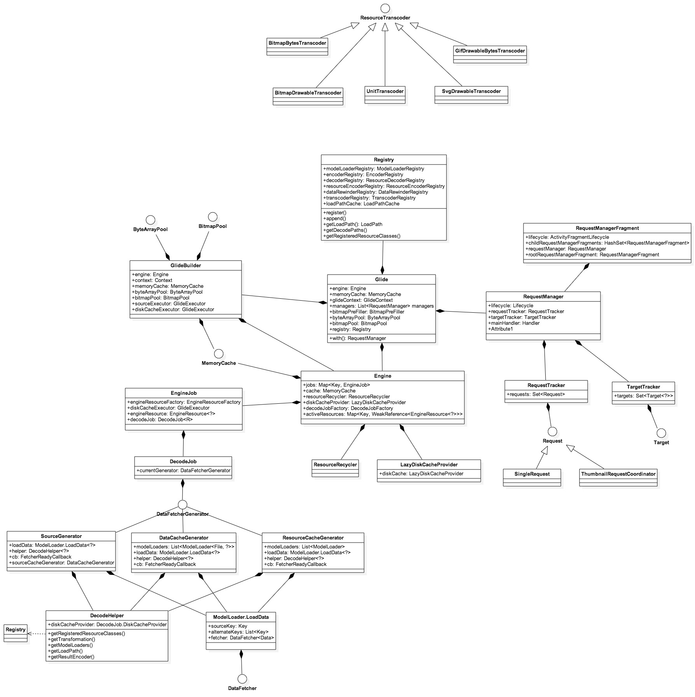
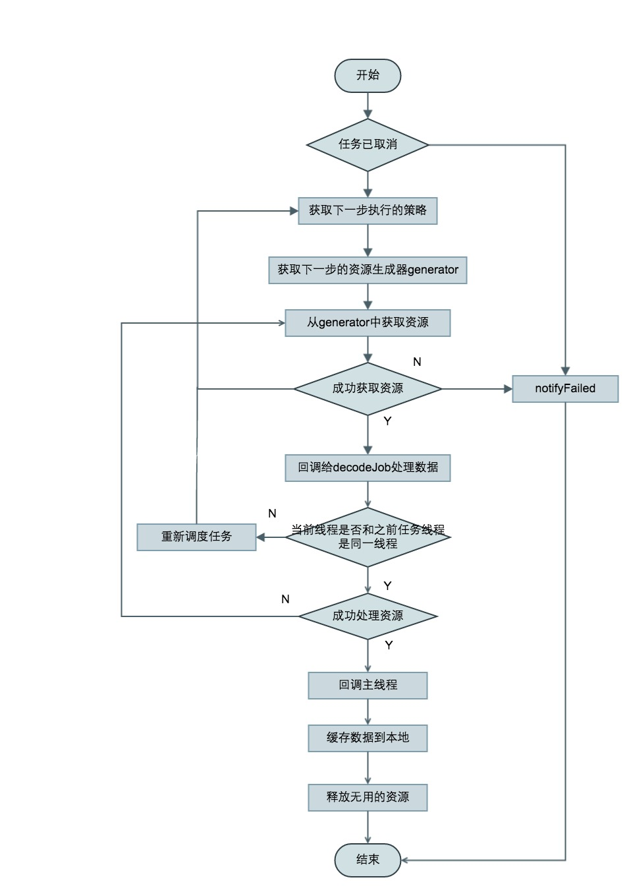

# Glide源码解析

====================================
> 本文为 [Android 开源项目源码解析](https://github.com/android-cn/android-open-project-analysis) 中 Glide 部分  
项目地址：[Glide](https://github.com/bumptech/glide)，分析的版本：[cb640b2](https://github.com/bumptech/glide/commit/cb640b2221044fe272ea6a249772cf71ba0d5fab)，Demo 地址：[Glide Demo](https://github.com/android-cn/android-open-project-demo/tree/master/${项目 Demo 地址})    
分析者：[lightSky](https://github.com/lightSky)，分析状态：未完成，校对者：待定，校对状态：未开始   

###1. 功能介绍  
图片加载框架，相对于UniversalImageLoader，Picasso，它还支持video，Gif，SVG格式，支持缩略图请求，旨在打造更好的列表图片滑动体验。Glide有生命周期的概念（主要是对请求进行pause，resume，clear），而且其生命周期与Activity/Fragment的生命周期绑定，支持Volley，OkHttp，并提供了相应的integration libraries，内存更加友好。

###2. 总体设计
####2.1 总体设计图
  

####2.2 Glide中的概念

**Glide**  
使用RequestBuilder创建request的静态接口，并持有Engine，BitmapPool，DiskCache，MemoryCache。
实现了ComponentCallbacks2，注册了低内存情况的回调。当内存不足的时候，进行相应的内存清理。回调的触发发生在RequestManagerFragment的onLowMemory和onTrimMemory中。

**GlideBuilder**  
为Glide创建一些默认值，比如：Engine，MemoryCache，DiskCache，RequestOptions，GlideExecutor，MemorySizeCalculator

**GlideModule**  
可以通过GlideBuilder进行一些延迟的配置和ModelLoaders的注册。

**注意：**   
所有的实现的module必须是public的，并且只拥有一个空的构造函数，以便Glide懒加载的时候可以通过反射调用。
GlideModule是不能指定调用顺序的。因此在创建多个GlideModule的时候，要注意不同Module之间的setting不要冲突了。
如何创建Module，请参看Demo

**ModelLoader**  
各种资源的ModelLoader<Model, Data> 

该接口有两个目的： 

- 将任意复杂的model转换为可以被decode的数据类型
- 允许model结合View的尺寸获取特定大小的资源

**Resource**  
对资源进行包装的接口，提供get，recycle，getSize，以及原始类的getResourceClass方法。
resource包下也就是各种资源：bitmap，bytes，drawable，file，gif，以及相关解码器，转换器

**Target**  
request的载体，各种资源对应的加载类，含有生命周期的回调方法，方便开发人员进行相应的准备以及资源回收工作。

**数据及处理相关概念**  

- data ：代表原始的，未修改过的资源，对应dataClass
- resource : 修改过的资源，对应resourceClass
- transcoder : 资源转换器，比如 BitmapBytesTranscoder（Bitmap转换为Bytes），GifDrawableBytes- Transcoder
- ResourceEncoder : 持久化数据的接口，这里注意下，该类并不与decoder相对应，而是用于本地缓存的接口
- ResourceDecoder : 数据解码器,比如ByteBufferGifDecoder（将ByteBuffer转换为Gif），StreamBitmapDecoder（Stream转换为Bitmap）

dataClass---(decoder解码)-->resourceClass

**ResourceTranscoder**  
资源转换器，将给定的资源类型，转换为另一种资源类型，比如将Bitmap转换为Drawable，Bitmap转换为Bytes  

resourceClass ---(transcoder转换)---> transcodeClass  
  
**Transformation**  
比如对图片进行FitCenter，CircleCrop，CenterCrop的transformation，或者根据给定宽高对Bitmap进行处理的BitmapDrawableTransformation  
  
**Registry**  
对Glide所支持的Encoder ，Decoder ，Transcoder组件进行注册
因为Glide所支持的数据类型太多，把每一种的数据类型及相应的处理方式的组合形象化为一种组件。通过registry的方式管理。
如下，注册了将使用BitmapDrawableTranscoder将 Bitmap转换为BitmapDrawable的组件。

```java
Registry.register(Bitmap.class, BitmapDrawable.class,new BitmapDrawableTranscoder(resources, bitmapPool))
```

**ThumbnailRequestCoordinator**  
请求协调器，包含两个请求：缩略图请求＋完整图片请求  


###3. 流程图

  


###4. 详细设计
####4.1 类关系图

  

####4.2 类详细介绍
#####4.2.1 Glide  
向外暴露单例静态接口，构建Request，配置资源类型，缓存策略，图片处理等，可以直接通过该类完整简单的图片请求和填充。内存持有一些内存变量`BitmapPool`，`MemoryCache`，`ByteArrayPool`，便于低内存情况时自动清理内存。

#####4.2.2 RequestBuilder 
创建请求，资源类型配置，缩略图配置，以及通过BaseRequestOptions进行一些默认图，图片处理的配置  

**主要函数**  
(1) **thumbnail(@Nullable RequestBuilder<TranscodeType> thumbnailRequest)**  
配置缩略图的请求，如果配置的缩略图请求在完整的图片请求完成前回调，那么该缩略图会展示，如果在完整请求之后，那么缩略图就无效。Glide不会保证缩略图请求和完整图片请求的顺序。 

(2) **多个load重载的方法**  
指定加载的数据类型  
load(@Nullable Object model)  
load(@Nullable String string)  
load(@Nullable Uri uri)  
load(@Nullable File file)  
load(@Nullable Integer resourceId)  
load(@Nullable URL url)  
load(@Nullable byte[] model)

(3) **buildRequest(Target<TranscodeType> target)**   
创建请求，如果配置了thumbnail（缩略图）请求，则构建一个ThumbnailRequestCoordinator（包含了FullRequest和ThumbnailRequest）请求，否则简单的构建一个Request。  

(4) **into(Y target)**  
设置资源的Target，并创建，绑定，跟踪，发起请求

**整个请求的创建流程图**  
  

#####4.2.3 Engine
任务创建，发起，回调，管理存活和缓存的资源

**主要函数**  

**(1) loadFromCache(Key key, boolean isMemoryCacheable)**   
从内存缓存中获取资源，获取成功后会放入到activeResources中

**(2) loadFromActiveResources**  
从存活的资源中加载资源，资源加载完成后，再将这个缓存数据放到一个 value 为软引用的 activeResources map 中，并计数引用数，在图片加载完成后进行判断，如果引用计数为空则回收掉。

**(3) getReferenceQueue**  
activeResources是一个持有缓存WeakReference的Map集合。ReferenceQueue就是提供资源WeakReference的虚引用队列。
`activeResources.put(key, new ResourceWeakReference(key, cached, getReferenceQueue()));`  
这里要提的是负责清除WeakReference被回收的activeResources资源的实现：  
使用到了MessageQueue.IdleHandler，源码的注释：当一个线程等待更多message的时候会触发该回调,就是messageQuene空闲的时候会触发该回调

```java
/**
* Callback interface for discovering when a thread is going to block
* waiting for more messages.
*/
public static interface IdleHandler {
/**
* Called when the message queue has run out of messages and will now
* wait for more.  Return true to keep your idle handler active, false
* to have it removed.  This may be called if there are still messages
* pending in the queue, but they are all scheduled to be dispatched
* after the current time.
*/
boolean queueIdle();
}

resourceReferenceQueue = new ReferenceQueue<>();
MessageQueue queue = Looper.myQueue();
queue.addIdleHandler(new RefQueueIdleHandler(activeResources, resourceReferenceQueue));

```

`RefQueueIdleHandler`实现了`MessageQueue.IdleHandler`接口，该接口有一个`queueIdle`方法，负责清除WeakReference被回收的activeResources资源。

(4) **load(
GlideContext glideContext,
Object model,
Key signature,
int width,
int height,
Class<?> resourceClass,
Class<R> transcodeClass,
Priority priority,
DiskCacheStrategy diskCacheStrategy,
Map<Class<?>, Transformation<?>> transformations,
boolean isTransformationRequired,
Options options,
boolean isMemoryCacheable,
ResourceCallback cb)**   
真正的开始加载资源，看下面的流程图

**load调用处理流程图：**  
注：DecodeJob是整个任务的核心部分，在下面DecodeJob中有详细介绍，这里主要整个流程  


###4.2.4 EngineJob 
调度DecodeJob，添加，移除资源回调，并notify回调    

####主要方法  
**(1)start(DecodeJob<R> decodeJob)**  
调度一个DecodeJob任务  

**(2) MainThreadCallback**  
实现了Handler.Callback接口，用于Engine任务完成时回调主线程  

###4.2.5  DecodeJob
实现了Runnable接口，调度任务的核心类，整个请求的繁重工作都在这里完成：处理来自缓存或者原始的资源，应用转换动画以及transcode。  
负责根据缓存类型获取不同的Generator加载数据，数据加载成功后回调DecodeJob的onDataFetcherReady方法对资源进行处理

####主要方法  

**(1) runWrapped()**
根据不同的runReason执行不同的任务，共两种任务类型：

- runGenerators():load数据
- decodeFromRetrievedData()：处理已经load到的数据

**RunReason**  
再次执行任务的原因，三种枚举值：

- INITIALIZE:第一次调度任务
- WITCH_TO_SOURCE_SERVICE:本地缓存策略失败，尝试重新获取数据，两种情况；当stage为Stage.SOURCE，或者获取数据失败并且执行和回调发生在了不同的线程
- DECODE_DATA:获取数据成功，但执行和回调不在同一线程，希望回到自己的线程去处理数据

**(2) getNextStage**  
获取下一步执行的策略，一共5种策略：  
`INITIALIZE`，`RESOURCE_CACHE`，`DATA_CACHE`，`SOURCE`，`FINISHED`  

其中加载数据的策略有三种：  
`RESOURCE_CACHE`，`DATA_CACHE`，`SOURCE`，
分别对应的Generator:  

- `ResourceCacheGenerator`  ：尝试从修改过的资源缓存中获取，如果缓存未命中，尝试从DATA_CACHE中获取
- `DataCacheGenerator`  尝试从未修改过的本地缓存中获取数据，如果缓存未命中则尝试从SourceGenerator中获取
- `SourceGenerator`  从原始的资源中获取，可能是服务器，也可能是本地的一些原始资源

策略的配置在DiskCacheStrategy。开发者可通过BaseRequestOptions设置：  

- ALL
- NONE
- DATA
- RESOURCE
- AUTOMATIC（默认方式，依赖于DataFetcher的数据源和ResourceEncoder的EncodeStrategy）

**(3) getNextGenerator**
根据Stage获取到相应的Generator后会执行currentGenerator.startNext()，如果中途startNext返回true，则直接回调，否则最终会得到SOURCE的stage，重新调度任务

**(4) startNext**
从当前策略对应的Generator获取数据，数据获取成功则回调DecodeJob的`onDataFetcherReady`对资源进行处理。否则尝试从下一个策略的Generator获取数据。

**(5) reschedule**  
重新调度当前任务  

**(6) decodeFromRetrievedData**
获取数据成功后，进行处理，内部调用的是`runLoadPath(Data data, DataSource dataSource,LoadPath<Data, ResourceType, R> path)`    

**(7) DecodeCallback.onResourceDecoded**  
decode完成后的回调，对decode的资源进行transform
path.load(rewinder, options, width, height,
new DecodeCallback<ResourceType>(dataSource));

**数据加载流程图**  
class

####4.2.6  LoadPath
根据给定的数据类型的DataFetcher尝试获取数据，然后尝试通过一个或多个decodePath进行decode。  

####4.2.7  DecodePath
根据指定的数据类型对resource进行decode和transcode

####4.2.8 RequestTracker
追踪，取消，重启请求

####4.2.9 TargetTracker
持有当前所有存活的Target，并触发Target相应的生命周期方法。方便开发者在回调中，进行相应的处理。  

####4.2.10 RequestManagerFragment  
与当前上下文绑定的Fragment，统一管理当前上下文下的所有childFragment的请求。  
每一个Context都会拥有一个RequestManagerFragment，在自身的Fragment生命周期方法中触发listener相应的生命周期方法。 
复写了onLowMemory和onTrimMemory，低内存情况出现的时候，会调用RequestManager的相应方法进行内存清理。  

释放的内存有：

- bitmapPool： 
- memoryCache： 
- byteArrayPool： 

####4.2.11  RequestManager 
核心类之一，统一管理当前context相关的所有请求。
很重要的一个相关类:`RequestManagerFragment`。
当Glide.with(context)获取RequestManager的时候，Glide都会先尝试获取当前上下文相关的RequestManagerFragment。

####4.2.12 RequestManagerRetriever 
根据不同的Context获取相应的RequestManager，context可以是FragmentActivity，Activity，ContextWrapper。

####4.2.13 RequestManagerTreeNode
上文提到获取所有childRequestManagerFragments的RequestManager就是通过该类获得，就一个方法：getDescendants，作用就是基于给定的Context，获取所有的RequestManager。上下文层级由Activity或者Fragment获得，ApplicationContext的上下文不会提供RequestManager的层级关系，而且Application生命周期过长，所以生命周期的控制只针对于Activity和Fragment。

####4.2.14 LifecycleListener  
用于监听Activity或者Fragment的生命周期方法的接口，基本上请求相关的所有类都实现了该接口
- void onStart();
- void onStop();
- void onDestroy();  

####4.2.15 ActivityFragmentLifecycle  
用于注册，同步所有监听了Activity或者Fragment的生命周期事件的listener的帮助类。  

####4.2.16 DataFetcher
每一次通过ModelLoader加载资源的时候都会创建的实例。  
`loadData` ：异步方法，如果目标资源没有在缓存中找到时才会被调用,cancel方法也是。 
`cleanup`：清理或者回收DataFetcher使用的资源，在loadData提供的数据被decode完成后调用。

**主要方法**  
**(1) DataCallback**  
用于数据加载结果的回调,三种Generator实现了该接口    
```java
//数据load完成并且可用时回调
void onDataReady(@Nullable T data);
//数据load失败时回调
void onLoadFailed(Exception e);
```
**(2) getDataClass()**
返回fetcher尝试获取的数据类型

**(3) getDataSource()**
获取数据的来源

**(4) DataSource**
```
public enum DataSource {
//数据从本地硬盘获取，也有可能通过一个已经从远程获取到数据的Content Provider
LOCAL,
//数据从远程获取
REMOTE,
//数据来自未修改过的硬盘缓存
DATA_DISK_CACHE,
//数据来自已经修改过的硬盘缓存
RESOURCE_DISK_CACHE,
//数据来自内存
MEMORY_CACHE,
}
```

####4.2.17  DataFetcherGenerator
根据注册的ModelLoaders和model生成一系列的DataFetchers。

**FetcherReadyCallback**
DecodeJob实现的接口，包含以下方法：  
`reschedule`：在Glide自己的线程上再次调用startNext
当Generator从DataFetcher完成loadData时回调，含有的方法：
`onDataFetcherReady`：load完成
`onDataFetcherFailed`：load失败

####4.2.18  Registry  
管理组件（数据类型＋数据处理）的注册

**主要成员变量**  
- ModelLoaderRegistry ：注册所有数据加载的loader
- ResourceDecoderRegistry：注册所有资源转换的decoder  
- TranscoderRegistry：注册所有对decoder之后进行特殊处理的transcoder
- ResourceEncoderRegistry：注册所有持久化resource（处理过的资源）数据的encoder
- EncoderRegistry ： 注册所有的持久化原始数据的encoder

**标准的数据处理流程：**  


Glide在初始化的时候，通过Registry注册以下所有组件， 每种组件由功能及处理的资源类型组成：
- loader:     model＋data＋ModelLoaderFactory  
- decoder:    dataClass＋resourceClass＋decoder  
- transcoder: resourceClass＋transcodeClass  
- encoder:    dataClass＋encoder  
- resourceEncoder resourceClass + encoder
- rewind :    缓冲区处理

Decoder | Source | Resource | 
:--|:-- |:--  |
BitmapDrawableDecoder   | 	Bitmap              |		Drawable  
StreamBitmapDecoder     |  	InputStream         |  	Bitmap	
ByteBufferBitmapDecoder |	  ByteBuffer          |  	Bitmap  
GifFrameResourceDecoder | 	GifDecoder          |	 	Bitmap  
StreamGifDecoder 	      |	  InputStream         | 	GifDrawable  
ByteBufferGifDecoder	  |	  ByteBuffer          |	  Gif	  
SvgDecoder		          |		InputStream	        |   SVG  
VideoBitmapDecoder 	    |	  ParcelFileDescriptor|	  Bitmap  
FileDecoder             |		File                | 	file    
  
    
Transcoder | 数据源 | 转换后的资源 | 
:--|:-- |:--  |
BitmapBytesTranscoder   | 	Bitmap              |		Bytes  
BitmapDrawableTranscoder     |  	Bitmap         |  	Drawable	
GifDrawableBytesTranscoder |	  GifDrawable          |  	Bytes  
SvgDrawableTranscoder | 	Svg          |	 	Drawable  

`decode＋transcode`的处理流程称为decodePath。  
LoadPath是对decodePath的封装，持有一个decodePath的List。在通过modelloader.fetchData获取到data后，会对data进行decode，具体的decode操作就是通过loadPath来完成。
resourceClass就是asBitmap，asDrawable的bitmap或者drawable

**ModelLoaderRegistry**  
持有多个ModelLoader，model和数据类型按照优先级进行处理

loader注册示例：
registry  
.append(Integer.class, InputStream.class, new ResourceLoader.StreamFactory())
.append(GifDecoder.class, GifDecoder.class, new UnitModelLoader.Factory<GifDecoder>())

**主要函数**  
**(1) register，append，prepend**
注册各种功能的组件

**(2) getRegisteredResourceClasses(Class<Model> modelClass, Class<TResource> resourceClass, Class<Transcode> transcodeClass)**
获取Glide初始化时注册的所有resourceClass

**(3) getModelLoaders(Model model)**

**(4) hasLoadPath(Class<?> dataClass)**  
判断注册的组件是否可以处理给定的dataClass  

- 直接调用`getLoadPath(dataClass, resourceClass, transcodeClass)`  
- 该方法先从loadPathCache缓存中尝试获取LoadPath,如果没有，则先根据dataClass, resourceClass, transcodeClass获取所有的decodePaths，如果decodePaths不为空，则创建一个`LoadPath<>(dataClass, resourceClass, transcodeClass, decodePaths,exceptionListPool)` 并缓存起来。

**(5) getDecodePaths**
根据dataClass, resourceClass, transcodeClass从注册的组件中找到所有可以处理的组合decodePath。就是将满足条件的不同处理阶段（modelloader，decoder，transcoder）的组件组合在一起。满足处理条件的有可能是多个组合。因为decodePath的功能是进行decode和transcode，所以getDecodePath的目的就是要找到符合条件的decoder和transcoder然后创建DecodePath。


####4.2.19   ModelLoader<Model, Data>

ModelLoader是一个工厂接口。将任意复杂的model转换为准确具体的可以被DataFetcher获取的数据类型。
每一个model内部实现了一个ModelLoaderFactory，内部实现就是将model转换为Data

**重要成员**
`LoadData<Data>`  
Key sourceKey，用于表明load数据的来源。
List<Key> alternateKeys：指向相应的变更数据
DataFetcher<Data> fetcher：用于获取不在缓存中的数据

**重要方法**

**(1) buildLoadData**
返回一个LoadData

**(2) handles(Model model)**
判断给定的model是否可以被当前modelLoader处理

####4.2.20  ModelLoaderFactory 
根据给定的类型，创建不同的ModelLoader，因为它会被静态持有，所以不应该维持非应用生命周期的context或者对象。

####4.2.21 DataFetcherGenerator
通过注册的DataLoader生成一系列的DataFetcher
`DataCacheGenerator`：根据未修改的缓存数据生成DataFetcher
`ResourceCacheGenerator`：根据已处理的缓存数据生成DataFetcher
`SourceGenerator`：根据原始的数据和给定的model通过ModelLoader生成的DataFetcher

####4.2.22 DecodeHelper
getPriority
getDiskCache
getLoadPath
getModelLoaders
getWidth
getHeight

#### 如何监测当前context的生命周期？
为当前的上下文Activity或者Fragment绑定一个TAG为"com.bumptech.glide.manager"的RequestManagerFragment，然后把该fragment作为rootRequestManagerFragment，并加入到当前上下文的FragmentTransaction事务中，从而与当前上下文Activity或者Fragment的生命周期保持一致。

关键就是`RequestManagerFragment`，用于绑定当前上下文以及同步生命周期。比如当前的context为activity，那么activity对应的RequestManagerFragment就与宿主activity的生命周期绑定了。同样Fragment对应的RequestManagerFragment的生命周期也与宿主Fragment保持一致。

#### 请求管理的实现  
`pauseRequests`，`resumeRequests`  
在RequestManagerFragment对应Request Manager的生命周期方法中触发，最终由`RequestTracker`和`TargetTracker`处理。

**如何控制当前上下文的所有ChildFragment的请求？**
**情景：**  
假设当前上下文是Activity（Fragment类似）创建了多个Fragment，每个Fragment通过Glide.with(fragment.this)方式加载图片。

- 为每一个Fragment创建一个RequestManagerFragment（原因看下面）并提交到当前上下文的事务中。 
以上保证了每个Fragment以及对应的RequestManagerFragment生命周期是与Activity的生命周期绑定的。  
- 在RequestManagerFragment的onAttach方法中通过Glide.with(activity.this)先获得Activity（宿主）的`RequestManagerFragment`(rootRequestManagerFragment)，并将每个Fragment相应的RequestManagerFragment添加到childRequestManagerFragments集合中。  
- Activity通过childRequestManagerFragments获取所有childFragment的RequestManager对请求进行pause，resume。

同理，如果当前context是Fragment，Fragment对应的RequestManagerFragment可以获取它自己所有的Child Fragment的RequestManagerFragment。

可以参考RequestManager的两个方法：
`pauseRequestsRecursive`,`resumeRequestsRecursive`  ，

**resumeRequestsRecursive**
递归重启所有RequestManager下的所有request。

**pauseRequestsRecursive**
递归所有childFragments的RequestManager的 pauseRequest方法。
childFragments表示那些依赖当前Activity或者Fragment的所有fragments

- 如果当前Context是Activity，那么依附它的所有fragments的请求都会中止  
- 如果当前Context是Fragment，那么依附它的所有childFragment的请求都会中止  
- 如果当前的Context是ApplicationContext，或者当前的Fragment处于detached状态，那么只有当前的RequestManager的请求会被中止

**注意：**
在Android 4.2之前，如果当前的context是Fragment，那么它的childFragment的请求并不会被中止。但v4的support Fragment是可以的。

**如何管理没有ChildFragment的请求？**
很简单，只会存在当前context自己的RequestManagerFragment，那么伴随当前上下文的生命周期触发，会调用RequestManagerFragment的RequestManager相应的lefecycle方法实现请求的控制，资源回收。

**为何每一个上下文会创建自己的RequestManagerFragment？**
因为`RequestManagerRetriever.getSupportRequestManagerFragment(fm)`是通过FragmentManager来获取的

- 如果传入到Glide.with(...)的context是activity  
`fm = activity.getSupportFragmentManager();`  
- 如果传入到Glide.with(...)的context是Fragment
`fm = fragment.getChildFragmentManager();`

因为fm不同，而且如果一个activity下面有多个Fragment，并以Glide.with(fragment.this)的方式加载图片。那么每个Fragment都会为自己创建一个fm相关的RequestManagerFragment。

关键在于每一个上下文拥有一个自己的RequestManagerFragment。而传入的context不同，会返回不同的RequestManagerFragment，顶层上下文会保存所有的childRequestManagerFragments。

#### 请求的管理是如何巧妙的设计 ?
```java  
public interface Lifecycle {
/**
* Adds the given listener to the set of listeners managed by this Lifecycle implementation.
*/
void addListener(LifecycleListener listener);

/**
* Removes the given listener from the set of listeners managed by this Lifecycle implementation,
* returning {@code true} if the listener was removed sucessfully, and {@code false} otherwise.
*
* <p>This is an optimization only, there is no guarantee that every added listener will
* eventually be removed.
*/
void removeListener(LifecycleListener listener);
}
```

RequestManagerFragment初始化时会创建一个ActivityFragmentLifecycle对象传给Request Manager。RequestManager会通过ActivityFragmentLifecycle的 addListener方法注册一些listener。当RequestManagerFragment生命周期方法执行的时候，会遍历所有注册的LifecycleListener并执行相应生命周期方法。

**RequestManager注册的LifecycleListener类型**    

- RequestManager自身  
RequestManager自己实现了LifecycleListener。主要的请求管理也是在这里处理的。 
- RequestManagerConnectivityListener，该listener也实现了LifecycleListener，用于网络连接时进行相应的请求恢复。
这里的请求是指那些还未完成的请求，已经完成的请求并不会重新发起。

另外Target接口也是直接继承自LifecycleListener，因此开发者可以监听资源处理的整个过程，在不同阶段进行相应的处理。

###5. 杂谈
Glide相对于简洁的UML来说是相当的复杂，无论从设计上还是细节实现上，可能和Glide的强大功能有关。一些设计概念很少碰到，比如register，loadpath，整个数据处理流程的拆分三个部分，每个部分所支持的数据全部通过组件注册的方式来支持，很多方法或者构造函数会接收10多个参数，看着着实眼花缭乱。这里的分析把大体的功能模块分析了，比如请求的统一管理，生命周期的同步，具体的实现细节还有很大一部分的工作量。对于开源项目的初学者来说并不是一个好的项目，门槛太高。但其确实功能强大，效率更高。本篇分析也借鉴了Trinea在2015 MDCC上分享的文章[开源选型之 Android 三大图片缓存原理、特性对比](http://mp.weixin.qq.com/s?__biz=MzAxNjI3MDkzOQ==&mid=400056342&idx=1&sn=894325d70f16a28bfe8d6a4da31ec304&scene=2&srcid=10210byVbMGLHg7vXUJLgHaR&from=timeline&isappinstalled=0#rd)。


###参考文档
[开源选型之 Android 三大图片缓存原理、特性对比](http://mp.weixin.qq.com/s?__biz=MzAxNjI3MDkzOQ==&mid=400056342&idx=1&sn=894325d70f16a28bfe8d6a4da31ec304&scene=2&srcid=10210byVbMGLHg7vXUJLgHaR&from=timeline&isappinstalled=0#rd)
[get-to-know-glide-recommended-by-google](http://inthecheesefactory.com/blog/get-to-know-glide-recommended-by-google/en)  
[picasso-vs-imageloader-vs-fresco-vs-glide](http://stackoverflow.com/questions/29363321/picasso-v-s-imageloader-v-s-fresco-vs-glide)  
https://plus.google.com/+HugoVisser/posts/Rra8mrU1pCx  
http://blog.csdn.net/fancylovejava/article/details/44747759

