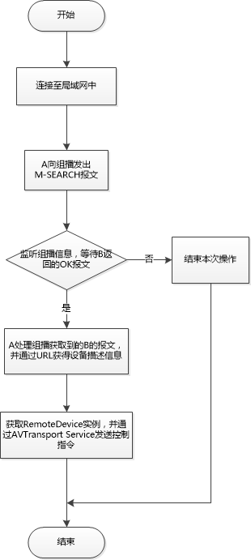
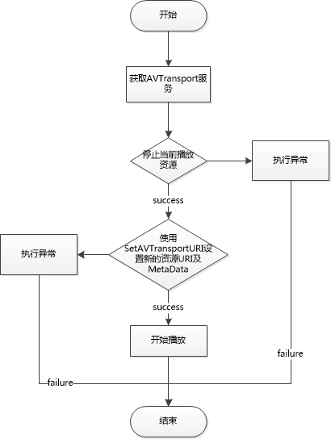
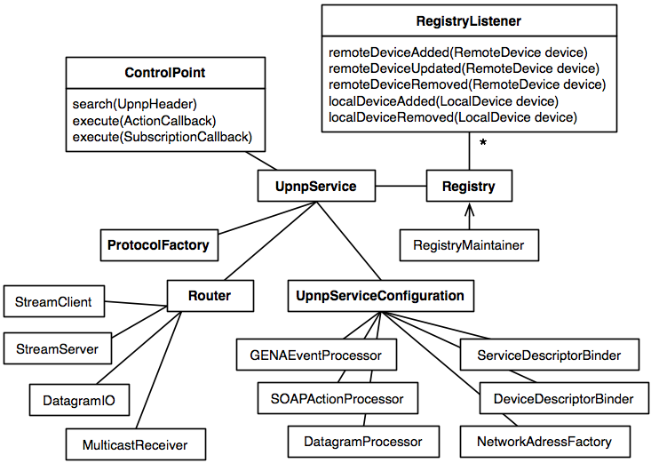

Cling源码解析
====================================
> 本文为 [Android 开源项目源码解析](https://github.com/android-cn/android-open-project-analysis) 中 Cling 部分  
> 项目地址：[cling](https://github.com/4thline/cling)，分析的版本：[5fd60eb](https://github.com/4thline/cling/commit/5fd60eb9e2e87f2ae6d1cf049145c4187040518c)，Demo 地址：[BeyondUPnP](https://github.com/kevinshine/BeyondUPnP)  
> 分析者：[kevinshine](https://github.com/kevinshine)，分析状态：完成，校对者：[Trinea](https://github.com/trinea)，校对状态：进行中   

###1. 功能介绍  
####1.1 Cling
Cling类库是由Java实现的DLNA/UPnP协议栈。基于DLNA/UPnP可以开发出类似多屏互动、资源共享、远程控制等功能的应用，通过Android应用管理一个或多个设备，将音频、视频、图片推送到指定设备显示。  

UPnP的实现类库有很多，如 CyberGarage，Intel UPnP stack，在 [http://www.upnp.org](http://upnp.org/certification/toolsoverview/sdks/) 上有详细列表，比较有名的有：  
- Platinum UPnP，基于C++开发，可以支持Windows，iOS，Android等平台，XBMC就是使用的此库。  
- Cling，基于Java开发，也是后续要介绍的，市面上很多支持DLNA功能的App都是使用的此库，如BubbleUPnP。  

####1.2 UPnP介绍
官方解释为：UPnP是各种各样的智能设备、无线设备和个人电脑等实现遍布全球的对等网络连接（P2P）的结构。
UPnP实际使用场景多用于小范围对等网络内（连接至同一路由器的多个设备）之间的相互发现、控制。如使用手机控制电视盒子的音频，视频播放等。  

UPnP 的工作过程大概分为 6 个步骤：  
(0) 寻址(Addressing)  
开始会给所有设备或者控制点分配一个分配一个 IP。对于新设备首次与网络建立连接时也会有这个寻址过程。  
 
(1) 发现(Discovery)  
这步是 UPnP 真正工作的第一步。  
当一个设备被加入到网络中时，UPnP 发现协议允许它向控制点介绍自己的功能。  
当一个控制点被加入到网络时，UPnP 发现协议允许它搜寻这个网络内它感兴趣的设备。  
 
(2) 描述(Description)  
控制点通过(1) 发现(Discovery)过程中设备提供的指向设备详细信息的链接，获取设备的详细信息。  
 
(3) 控制(Control)  
控制点通过描述过程对设备的了解，控制点可以发送控制信息控制设备，设备在执行完命令后会给与控制点一个反馈。  
 
(4) 事件(Eventing)  
控制点可以监听设备的状态，这样设备的状态或信息发生了变化，只要产生一个事件广播出去，控制点即可进行响应，类似一般的订阅者模式。  
 
(5) 展现(Presentation)  
控制点可以从设备获取一个 HTML 页面，用于控制设备或展现设备信息，是对上面(3) 控制和(4) 事件过程的一个补充。  
更详细的介绍可以参考：[UPnP 简介、优点及工作几大步骤介绍](http://www.trinea.cn/other/upnp-desc-advantage-process/)  

####1.3	Cling基本使用
Cling库包括两个模块：  
- Cling Core
核心类库，基于UDA1.0，实现了定义服务，设备发现，通过ControlPoint发送指令，等UPnP的基本功能。  
- Cling Support
顾名思义该包为Cling中一些功能的扩展，如：avtransport，lastchange等。  

下面就以Android平台创建UPnP服务并调用相关的控制方法介绍Cling的基本使用。  
(1) 定义自己的UpnpService类，继承自AndroidUpnpServiceImpl  
(2) 启动该Service  
(3) 从UpnpService中获取ControlPoint，并搜索设备  
```
upnpService.getControlPoint().search(new STAllHeader());
```
搜索注册在多播地址的所有设备，也可根据需要使用不同条件搜索。  

(4) 获取所有类型为MediaRenderer的设备  
```
upnpService.getRegistry().getDevices(new UDADeviceType("MediaRenderer"));
```

(5) 向Device发送指令  
从查找到的结果中获取一个Device,并向其发送Play指令  
```
Device device = SystemManager.getInstance().getSelectedDevice();
if (device == null) {
    return;
}

Service avtService = device.findService(new UDAServiceType("AVTransport"));
if (avtService != null) {
    ControlPoint cp = SystemManager.getInstance().getControlPoint();
    cp.execute(new Play(avtService) {
        @Override
        public void success(ActionInvocation invocation) {
            Log.i(TAG, "Play success.");
        }

        @Override
        public void failure(ActionInvocation arg0, UpnpResponse arg1, String arg2) {
            Log.e(TAG, "Play failed");
        }
    });
}
```
上述即为一个基本的发现、控制流程，通过ControlPoint发送指令并处理callback。  

**注：上述只涵盖了使用中的几个关键点，详细内容可参考我开源的项目[BeyondUPnP](https://github.com/kevinshine/BeyondUPnP)**  

###2 总体设计
####2.1 概述
Cling作为UPnP协议栈，其主旨即是在设备的发现，控制等过程中对不同的协议及内容进行处理。UPnP协议栈由多个层组成，Cling只关心底层的TCP/IP协议以及包含SSDP（设备发现），SOAP（设备控制），GENA（设备事件）协议的层。  

###2.2 使用场景
以一个简单的设备使用场景为例：  

> 用户将手机A中的媒体内容播放到电视B上，前提：A、B在同一个局域网中。
- A加入到多播组中，建立MulticastSocket监听多播信息
- A向多播发出M-SEARCH报文
- B获取多播的报文，判断是否符合条件，若符合向多播地址回应OK报文，报文中包含description URL
- A监听多播获取到相关报文，并通过URL获得设备描述信息
- A通过AVTransport Service将媒体内容推送到B并播放

在整个过程中A通过Cling既充当了DMC（Digital Media Controller）又作为DMS（Digital Media Server），而B作为DMR(Digital Media Renderer)播放媒体内容。  
关于 DMS、DMC、DMR 是指对电子设备的分类，具体可见：[DLNA 简介 设备分类 场景举例 协议栈层次](http://www.trinea.cn/other/dlna-desc-classes-architecture/)  

###3 流程图
####3.1 设备发现及控制流程


####3.2 媒体播放流程


###4 详细设计
####4.1 类关系图


####4.2 类功能详细介绍
由类图可知，Cling的一切都是从UpnpService开始的，其中包含了ControlPoint，ProtocolFactory，Registry，Router四个核心模块，以及一个配置信息类UpnpServiceConfiguration

####4.2.1 ControlPoint
异步执行搜索，设备控制订阅等指令,此接口定义了查找设备，向设备发送指令，订阅设备变更，其实现类只有一个为ControlPointImpl.

**(1) 查找**  
根据UpnpHeader查询指定的设备,UpnpHeader为抽象类其中定义了枚举类型的Type以及泛型value,查询时常用的实现类有:DeviceTypeHeader，UDNHeader等，可根据设备类型、UDN、服务类型等多种方式。  
```
public void search(UpnpHeader searchType, int mxSeconds);
```

**(2) 执行控制指令**  
将ActionCallback放入DefaultUpnpServiceConfiguration中定义的线程池ClingExecutor并执行，执行完毕回调ActionCallback中定义的success或failure函数。  
```
public Future execute(ActionCallback callback) {
        callback.setControlPoint(this);
        ExecutorService executor = getConfiguration().getSyncProtocolExecutorService();
        return executor.submit(callback);
    }
```

####4.2.2 ProtocolFactory
协议处理工厂类使用Simple Factory Pattern封装协议内容的处理，具体实现为ProtocolFactoryImpl,分为接收报文处理和创建发送报文两部分。  
在该类中UDP包通过createReceivingAsync方法对传递来的IncomingDatagramMessage进行处理。  
如NOTIFY--ReceivingNotification，MSEARCH--ReceivingSearch。TCP包通过createReceivingSync进行分发处理，并通过ReceivingSync的子类进行处理，子类中调用executeSync方法等待并返回response。  

**(1) 处理接收到的报文**  
IncomingDatagramMessage封装了UDP包的信息，在createReceivingAsync中分发到对应的处理方法中并创建处理对象，如NOTIFY--ReceivingNotification，MSEARCH--ReceivingSearch。  
```
public ReceivingAsync createReceivingAsync(IncomingDatagramMessage message){
	if (message.getOperation() instanceof UpnpRequest) {
            IncomingDatagramMessage<UpnpRequest> incomingRequest = message;

            switch (incomingRequest.getOperation().getMethod()) {
                case NOTIFY:
                    return isByeBye(incomingRequest) || isSupportedServiceAdvertisement(incomingRequest)
                        ? createReceivingNotification(incomingRequest) : null;
                case MSEARCH:
                    return createReceivingSearch(incomingRequest);
            }

        } else if (message.getOperation() instanceof UpnpResponse) {
            IncomingDatagramMessage<UpnpResponse> incomingResponse = message;

            return isSupportedServiceAdvertisement(incomingResponse)
                ? createReceivingSearchResponse(incomingResponse) : null;
        }
}
```
StreamRequestMessage封装TCP报文，通过createReceivingSync分发处理，ReceivingSync子类中重写executeSync方法定义具体实现。  
```
public ReceivingSync createReceivingSync(StreamRequestMessage message){
	if (message.getOperation().getMethod().equals(UpnpRequest.Method.GET)) {
            return createReceivingRetrieval(message);
        } else if (getUpnpService().getConfiguration().getNamespace().isControlPath(message.getUri())) {
            if (message.getOperation().getMethod().equals(UpnpRequest.Method.POST))
                return createReceivingAction(message);
        } else if (getUpnpService().getConfiguration().getNamespace().isEventSubscriptionPath(message.getUri())) {
            if (message.getOperation().getMethod().equals(UpnpRequest.Method.SUBSCRIBE)) {
                return createReceivingSubscribe(message);
            } else if (message.getOperation().getMethod().equals(UpnpRequest.Method.UNSUBSCRIBE)) {
                return createReceivingUnsubscribe(message);
            }
        }
       ........
}
```
**(2) 组装发送的报文**  
有若干功能类似的方法，如：  
向组播发送ssdp:alive告知设备存活  
```
public SendingNotificationAlive createSendingNotificationAlive(LocalDevice localDevice)
```
生产SendingSearch实例的工厂方法，SendingSearch中定义了查询条件以及请求超时时间，并Override了execute(),在线程启动后创建OutgoingSearchRequest对象并通过Router发送。  
```
public SendingSearch createSendingSearch(UpnpHeader searchTarget, int mxSeconds)
```

####4.2.3 Registry
协议栈的核心，实现类为RegistryImpl,可把其看做一个注册表，当发现新设备时将其加入Registry，当该设备失效后从Registry中移除,设备的订阅信息也在此维护。  
该类中通过下列类对注册内容以及订阅内容等进行处理:  
- RegistryListener
注册表监听类，定义为一组监听器，Set<RegistryListener> registryListeners。
实现类为DefaultRegistryListener，监听Device的add，remove动作。

- Resource
资源的父类。该类中定义资源的URI，model等属性。

- ExpirationDetails
每个RegistryItem对象都有自己的ExpirationDetails，ExpirationDetails通过构造函数传递的maxAgeSeconds记录最大超时时间，在每次maintain时判断该RegistryItem是否过期。

- RegistryMaintainer
用来每隔1000ms调用一次registry.maintain()方法，该方法执行的操作有：
(1) 判断过期的item，并从resourceItems中移除；  
(2) 遍历resourceItems，并对其中的每个Resource调用其maintain()方法；  
(3) remoteItems.maintain()对remote进行维护；  
(4) localItems.maintain()对local进行维护；  
(5) runPendingExecutions执行异步任务。  

- RemoteItems
包含deviceItems集合，定义了对RemoteDevice的增删查改等操作。  
保存search后的RemoteDevice集合。

- LocalItems
继承自RegistryItems，包含了对LocalDevice的操作。

####4.2.4 Router
Router为数据收发处理的核心类，实现类为RouterImpl。在其中通过重入读写锁控制设备的启用和禁用，并  
**(1) 并发控制**  
使用可重入读写锁ReentrantReadWriteLock实现设备并发读写的控制  
```
protected volatile boolean enabled;
protected ReentrantReadWriteLock routerLock = new ReentrantReadWriteLock(true);
protected Lock readLock = routerLock.readLock();
protected Lock writeLock = routerLock.writeLock();

//writeLock只在enable()和disable()函数尝试获取并禁止其他线程访问，完成操作后释放unlock(writeLock)
public boolean enable() throws RouterException {
        lock(writeLock);
        try {
            if (!enabled) {
                .....
            }
            return false;
        } finally {
            unlock(writeLock);
        }
    }

//多个线程可同时获取读锁lock(readLock)并发处理内容
public void send(OutgoingDatagramMessage msg) throws RouterException {
        lock(readLock);
        try {
            if (enabled) {
                for (DatagramIO datagramIO : datagramIOs.values()) {
                    datagramIO.send(msg);
                }
            } else {
                log.fine("Router disabled, not sending datagram: " + msg);
            }
        } finally {
            unlock(readLock);
        }
    }
```

**(2) 获取网络信息**  
NetworkAddressFactory的实现类NetworkAddressFactoryImpl提供网络相关内容，如NetworkAddress，interface等。  

**(3) 初始化**  
startAddressBasedTransports函数，将绑定到router上的ip及端口都以StreamServer的方式进行监听。每一个StreamServer对应一个DatagramIO，进行数据处理。  

startInterfaceBasedTransports函数，对应每个NetworkInterface创建对应的MulticastReceiver，用来监听多播地址，并处理获取到的数据。  

**(4) 发送数据**  
send(StreamRequestMessage msg) 通过StreamClient发送TCP包。  
send(OutgoingDatagramMessage msg) 通过datagramIO发送多播的UDP包。

**(5) StreamClient**  
StreamClient具体实现类为AbstractStreamClient以及其子类StreamClientImpl。  
在Android系统下使用的Jetty实现。在该类中具体的http协议处理由HttpClient实现，核心方法sendRequest用于创建请求并获取返回response，请求及返回值通过HttpContentExchange封装，每一个StreamRequestMessage及其对应的HttpContentExchange通过createCallable方法封装为Callable对象，并将其压入DefaultUpnpServiceConfiguration中的defaultExecutorService。在call()中调用client.send(exchange)发送request并获取response。  

**(6) StreamServer**  
StreamServer用来接收HTTP请求并进行处理。在AndroidUpnpServiceConfiguration中进行初始化：  
```
public StreamServer createStreamServer(NetworkAddressFactory networkAddressFactory) {
        // Use Jetty, start/stop a new shared instance of JettyServletContainer
        return new AsyncServletStreamServerImpl(
            new AsyncServletStreamServerConfigurationImpl(
                JettyServletContainer.INSTANCE,
                networkAddressFactory.getStreamListenPort()
            )
        );
    }
```
本质上是由Jetty实现的servlet容器。从HttpServletRequest中获取数据流并传递给Router的received(UpnpStream stream)进行处理。JettyServletContainer使用了单例模式，其中定义Server的具体实现，并使用synchronized同步Server属性变更操作。  

**(7) ReceivingNotification**  
处理接收到的notification消息。如ALIVE，BYEBYE。当接收到ALIVE消息后，会在后台启动一个线程执行RetrieveRemoteDescriptors获取该设备的信息。  

**(8) RetrieveRemoteDescriptors**  
用来主动获取远端内容，并返回RemoteService加入到Registry中。  

###5 结语
Cling作为一款优秀的开源UPnP协议栈实现，从之前的1.x版本发展到现在的2.x，在稳定性易扩展等方面有着显著的提升，由于对Android平台有着较好的支持，越来越多的产品使用Cling作为解决方案，如BubbleUPnP等。当然它本身也还存在着如Router切换WIFI时注册设备清除失败等问题，但瑕不掩瑜，本着学习的态度还是可以从中受益良多。  