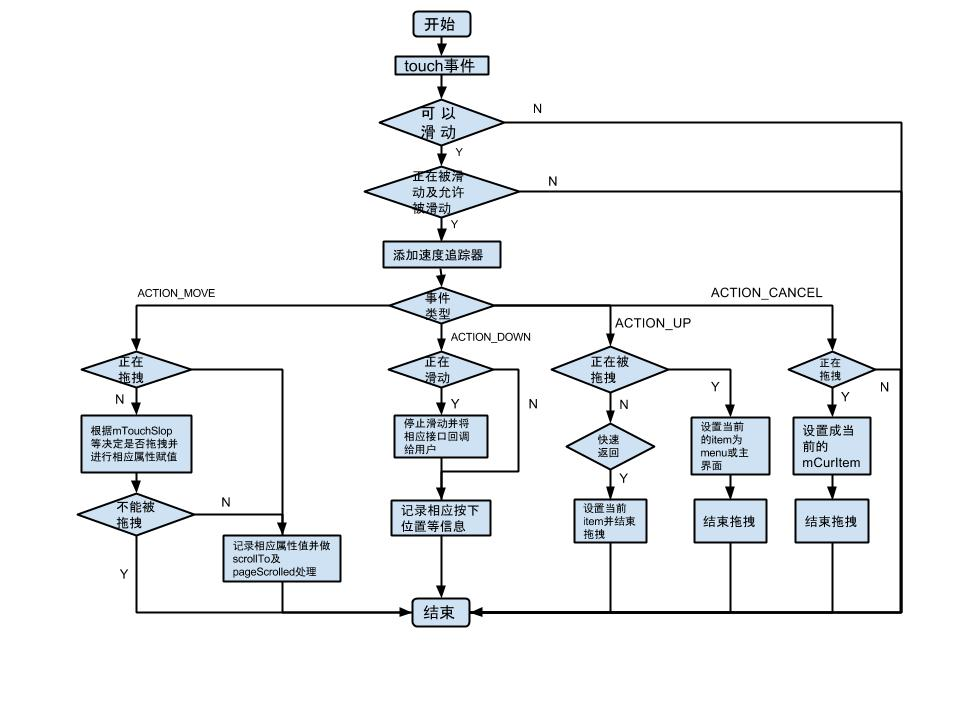

SlidingMenu 源码解析
====================================
> 本文为 [Android 开源项目源码解析](https://github.com/android-cn/android-open-project-analysis) 中 SlidingMenu 部分  
> 项目地址：[SlidingMenu](https://github.com/jfeinstein10/SlidingMenu)，分析的版本：[4254fec](https://github.com/jfeinstein10/SlidingMenu/commit/4254feca3ece9397cd501921ee733f19ea0fdad8)，Demo 地址：[SlidingMenu Demo](https://github.com/aosp-exchange-group/android-open-project-demo/tree/master/sliding-menu-demo)  
> 分析者：[huxian99](https://github.com/huxian99)，校对者： 校对状态：未开始  

##1. 功能介绍  
现在主流app的导航栏一般有两种，一种是主界面上面3－4个tab下面搭配ViewPager+Fragment，另一种就是侧边栏，如果主导航超过3个tab时，建议使用侧边栏作为app的主导航。  
SlidingMenu是一个强大的侧边栏导航框架，并且已经被一些比较牛的app使用，主要特点如下：  
(1).侧边栏可以是一个Fragment，包含任何View  
(2).使用简单方便，支持左滑和右滑等  
(3).自定义侧边栏显示动画  

##2. 总体设计
SlidingMenu总体由三个主要的类组成  
SlidingMenu继承自RelativeLayout，对外暴露API给用户，同时在添加CustomViewAbove和CustomViewBehind  
CustomViewAbove继承自ViewGroup，主要用来处理触摸屏事件  
CustomViewBehind继承自ViewGroup，主要用来显示侧边栏的menu部分  

##3. 流程图
请参考 `4.2.2 CustomViewAbove事件处理流程图`  

##4. 详细设计
####4.2.1 SlidingMenu.java  
继承自RelativeLayout，对外提供API，用于配置侧边栏的侧滑模式，触摸模式，阴影，渐变及滑动效果等  
构造器中可以看到主要初始化了mViewBehind，mViewAbove及一些属性。  
主要看attachToActivity方法
```java
public void attachToActivity(Activity activity, int slideStyle, boolean actionbarOverlay)
```
主要部分
```java
mActionbarOverlay = false;
ViewGroup decor = (ViewGroup) activity.getWindow().getDecorView();
ViewGroup decorChild = (ViewGroup) decor.getChildAt(0);
// save ActionBar themes that have transparent assets
decorChild.setBackgroundResource(background);
decor.removeView(decorChild);
decor.addView(this);
setContent(decorChild);
```
可以看到主要是获取decorView，将decorView下面的decorChild移除，把SlidingMenu添加进来，把decorChild赋值给mViewAbove  
####4.2.2 CustomViewAbove.java  
继承自ViewGroup，主要用于处理touch事件  
事件处理流程图如下：  
  
####4.2.3 CustomViewBehind.java  
主要的属性  
```java
/** 第一个侧边栏，一般为左边栏 */  
private View mContent;
/** 第二个侧边栏，一般为右边栏 */  
private View mSecondaryContent;  
/** 滑动侧边栏的最大临界值在设置TOUCHMODE_MARGIN起作用，默认48dp */  
private int mMarginThreshold;  
/** 侧边栏被滑出后，主界面留在屏幕上的offset */  
private int mWidthOffset;  
/** 有三个值可以选，LEFT/RIGHT/LEFT_RIGHT */  
private int mMode;  
/** 侧边栏在侧滑过程中是否需要fade动画效果 */  
private boolean mFadeEnabled;  
/** 定义滑动比例的值，范围0-1f */  
private float mScrollScale;  
/** 侧边栏滑出后的阴影部分，demo中用的是Gradient */  
private Drawable mShadowDrawable;  
/** 同上，为第二个侧边栏的阴影部分 */  
private Drawable mSecondaryShadowDrawable;  
/** 阴影部分的宽 */  
private int mShadowWidth;  
/** 侧边栏滑动过程中fade动画的值，范围0-1f */  
private float mFadeDegree;  
```  

##5. 杂谈
该项目存在的问题、可优化点及类似功能项目对比等，非所有项目必须。  

**完成时间**  
- `两天内`完成  

##6. 修改完善  
在完成了上面 5 个部分后，移动模块顺序，将  
`2. 详细设计` -> `2.1 核心类功能介绍` -> `2.2 类关系图` -> `3. 流程图` -> `4. 总体设计`  
顺序变为  
`2. 总体设计` -> `3. 流程图` -> `4. 详细设计` -> `4.1 类关系图` -> `4.2 核心类功能介绍`  
并自行校验优化一遍，确认无误后将文章开头的  
`分析状态：未完成`  
变为：  
`分析状态：已完成`  

本期校对会由专门的`Buddy`完成，可能会对分析文档进行一些修改，请大家理解。  

**完成时间**  
- `两天内`完成  

**到此便大功告成，恭喜大家^_^**  

