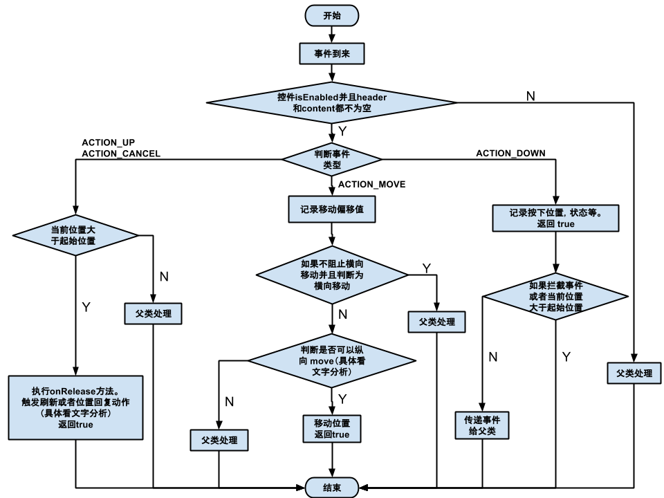
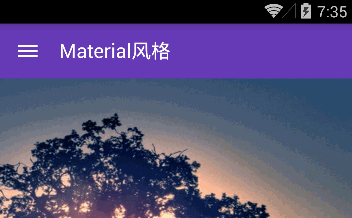
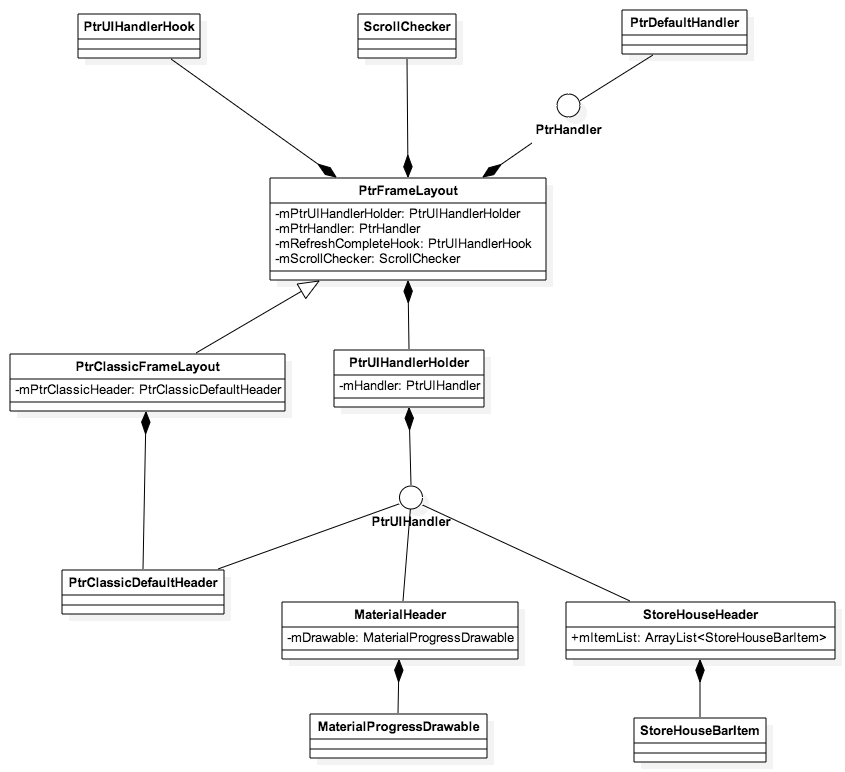
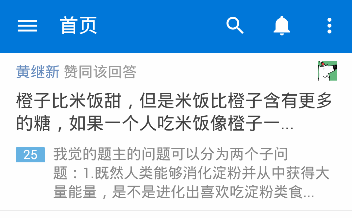
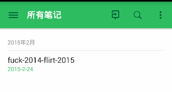

android-Ultra-Pull-To-Refresh 源码解析
====================================
> 本文为 [Android 开源项目源码解析](https://github.com/android-cn/android-open-project-analysis) 中 android-Ultra-Pull-To-Refresh 部分  
> 项目地址：[android-Ultra-Pull-To-Refresh](https://github.com/liaohuqiu/android-Ultra-Pull-To-Refresh)，分析的版本：[508c632](https://github.com/liaohuqiu/android-Ultra-Pull-To-Refresh/tree/508c63266de51ad8c010ac9912f7592b2f2da8fc)，Demo 地址：[android-Ultra-Pull-To-Refresh Demo](https://github.com/android-cn/android-open-project-demo/tree/master/android-ultra-pull-to-refresh-demo)  
> 分析者：[Grumoon](https://github.com/grumoon)，校对者：[lightSky](https://github.com/lightSky)，校对状态：未完成  

###1. 功能介绍  
下拉刷新，几乎是每个 Android 应用都会需要的功能。 android-Ultra-Pull-To-Refresh （以下简称 UltraPTR ）便是一个强大的 Andriod 下拉刷新框架。  
主要特点：  
(1).继承于 ViewGroup ， Content 可以包含任何 View 。  
(2).简洁完善的 Header 抽象，方便进行拓展，构建符合需求的头部。  
> 对比 [Android-PullToRefresh](https://github.com/chrisbanes/Android-PullToRefresh) 项目，UltraPTR 没有实现 **加载更多** 的功能，但我认为 **下拉刷新** 和 **加载更多** 不是同一层次的功能， **下拉刷新** 有更广泛的需求，可以适用于任何页面。而 **加载更多** 的功能应该交由具体的 Content 自己去实现。这应该是和 Google 官方推出 SwipeRefreshLayout 是相同的设计思路，但对比 SwipeRefreshLayout ， UltraPTR 更灵活，更容易拓展。

###2. 总体设计
UltraPTR 总体设计比较简单清晰。  
首先抽象出了两个接口，功能接口和 UI 接口。  
PtrHandler 代表下拉刷新的功能接口，包含刷新功能回调方法以及判断是否可以下拉的方法。用户实现此接口来进行数据刷新工作。   
PtrUIHandler 代表下拉刷新的 UI 接口，包含准备下拉，下拉中，下拉完成，重置以及下拉过程中的位置变化等回调方法。通常情况下， Header 需要实现此接口，来处理下拉刷新过程中头部 UI 的变化。  
整个项目围绕核心类 PtrFrameLayout 。 PtrFrameLayout 代表了一个下拉刷新的自定义控件。  
PtrFrameLayout 继承自 ViewGroup ，有且只能有两个子 View ，头部 Header 和内容 Content 。通常情况下 Header 会实现 PtrUIHandler 接口， Content 可以为任意的 View 。  
和所有的自定义控件一样， PtrFrameLayout 通过重写 onFinishInflate ， onMeasure ， onLayout 来确定控件大小和位置。通过重写 dispatchTouchEvent 来确定控件的下拉行为。  

###3. 流程图
请参照 `4.1.5 PtrFrameLayout 事件拦截流程图`

###4. 详细设计
###4.1 核心类功能介绍

####4.1.1 PtrHandler.java
下拉刷新功能接口，对下拉刷新功能的抽象，包含以下两个方法。  
```java
public void onRefreshBegin(final PtrFrameLayout frame)
```  
刷新回调函数，用户在这里写自己的刷新功能实现，处理业务数据的刷新。  

```java
public boolean checkCanDoRefresh(final PtrFrameLayout frame, final View content, final View header)
```
判断是否可以下拉刷新。 UltraPTR 的 Content 可以包含任何内容，用户在这里判断决定是否可以下拉。  
例如，如果 Content 是 TextView ，则可以直接返回 true ，表示可以下拉刷新。  
如果 Content 是 ListView ，当第一条在顶部时返回 true ，表示可以下拉刷新。  
如果 Content 是 ScrollView ，当滑动到顶部时返回 true ，表示可以刷新。  

####4.1.2 PtrDefaultHandler.java
抽象类，实现了 PtrHandler.java 接口，给出了 `checkCanDoRefresh` 的默认实现，给出了常见 View 是否可以下拉的判断方法。  
```java
@Override
public boolean checkCanDoRefresh(PtrFrameLayout frame, View content, View header) {
	return checkContentCanBePulledDown(frame, content, header);
}
public static boolean checkContentCanBePulledDown(PtrFrameLayout frame, View content, View header) {
    /**
     * 如果Content不是ViewGroup，返回true,表示可以下拉</br>
     * 例如：TextView，ImageView
     */
    if (!(content instanceof ViewGroup)) {
        return true;
    }
    
    ViewGroup viewGroup = (ViewGroup) content;

    /**
     * 如果Content没有子View（内容为空）时候，返回true，表示可以下拉
     */
    if (viewGroup.getChildCount() == 0) {
        return true;
    }

    /**
     * 如果Content是AbsListView（ListView，GridView），当第一个item不可见是，返回false，不可以下拉。
     */
    if (viewGroup instanceof AbsListView) {
        AbsListView listView = (AbsListView) viewGroup;
        if (listView.getFirstVisiblePosition() > 0) {
            return false;
        }
    }

    /**
     * 如果SDK版本为14以上，可以用canScrollVertically判断是否能在竖直方向上，向上滑动</br>
     * 不能向上，表示已经滑动到在顶部或者Content不能滑动，返回true，可以下拉</br>
     * 可以向上，返回false，不能下拉
     */
    if (Build.VERSION.SDK_INT >= 14) {
        return !content.canScrollVertically(-1);
    } else {
        /**
         * SDK版本小于14，如果Content是ScrollView或者AbsListView,通过getScrollY判断滑动位置 </br>
         * 如果位置为0，表示在最顶部，返回true，可以下拉
         */
        if (viewGroup instanceof ScrollView || viewGroup instanceof AbsListView) {
            return viewGroup.getScrollY() == 0;
        }
    }

    /**
     * 最终判断，判断第一个子View的top值</br>
     * 如果第一个子View有margin，则当top==子view的marginTop+content的paddingTop时，表示在最顶部，返回true，可以下拉</br>
     * 如果没有margin，则当top==content的paddinTop时，表示在最顶部，返回true，可以下拉
     */
    View child = viewGroup.getChildAt(0);
    ViewGroup.LayoutParams glp = child.getLayoutParams();
    int top = child.getTop();
    if (glp instanceof ViewGroup.MarginLayoutParams) {
        ViewGroup.MarginLayoutParams mlp = (ViewGroup.MarginLayoutParams) glp;
        return top == mlp.topMargin + viewGroup.getPaddingTop();
    } else {
        return top == viewGroup.getPaddingTop();
    }
}
```
这里特别注意一下，以上代码中存在一些小bug。[Issue](https://github.com/liaohuqiu/android-Ultra-Pull-To-Refresh/issues/30)
```java
if (viewGroup instanceof ScrollView || viewGroup instanceof AbsListView) {
    return viewGroup.getScrollY() == 0;
}
```
如果 Content 是 AbsListView（ListView，GridView），通过 getScrollY() 获取的值一直是 0 ，所以这段代码的判断，无效。  

> **注意：上述 bug ，在新版本 ([3a34b2e](https://github.com/liaohuqiu/android-Ultra-Pull-To-Refresh/tree/3a34b2e89f9dc4522569ce9340910621fd543828)) 中已经做出了修复。以下是最新版本的代码。**
> ```java
public static boolean canChildScrollUp(View view) {
    if (android.os.Build.VERSION.SDK_INT < 14) {
        if (view instanceof AbsListView) {
            final AbsListView absListView = (AbsListView) view;
            return absListView.getChildCount() > 0
                    && (absListView.getFirstVisiblePosition() > 0 || absListView.getChildAt(0)
                    .getTop() < absListView.getPaddingTop());
        } else {
            return view.getScrollY() > 0;
        }
    } else {
        return view.canScrollVertically(-1);
    }
}
> ```
> ```java
public static boolean checkContentCanBePulledDown(PtrFrameLayout frame, View content, View header) {
    return !canChildScrollUp(content);
}
> ```
```java
@Override
public boolean checkCanDoRefresh(PtrFrameLayout frame, View content, View header) {
    return checkContentCanBePulledDown(frame, content, header);
}
> ```
> 新的判断方式也比较简单明了。  
> 当然以上给出的是针对通用 View 的判断方式。如果遇到特殊需求的 View ，或者自定义 View 。使用者还是要自己实现符合需求的判断。

####4.1.3 PtrUIHandler.java
下拉刷新 UI 接口，对下拉刷新 UI 变化的抽象。一般情况下， Header 会实现此接口，处理下拉过程中的头部 UI 的变化。  
包含以下5个方法。  
```java
public void onUIReset(PtrFrameLayout frame);
```
Content 重新回到顶部， Header 消失，整个下拉刷新过程完全结束以后，重置 View 。
```java
public void onUIRefreshPrepare(PtrFrameLayout frame);
```
准备刷新，Header 将要出现时调用。
```java
public void onUIRefreshBegin(PtrFrameLayout frame);
```
开始刷新，Header 进入刷新状态之前调用。
```java
public void onUIRefreshComplete(PtrFrameLayout frame);
```
刷新结束，Header 开始向上移动之前调用。
```java
public void onUIPositionChange(PtrFrameLayout frame, boolean isUnderTouch, byte status, int oldPosition, int currentPosition, float oldPercent, float currentPercent);
```
下拉过程中位置变化回调。
####4.1.4 PtrUIHandlerHolder.java
实现 UI 接口 PtrUIHandler ，封装了 PtrUIHandler ，并将其组织成链表的形式。之所以封装成链表的目的是作者希望调用者可以像Header一样去实现PtrUIHandler，能够捕捉到onUIReset，onUIRefreshPrepare，onUIRefreshBegin，onUIRefreshComplete 这几个时机去实现自己的逻辑或者UI效果，而它们统一由PtrUIHandlerHolder来管理，你只需要 通过addHandler方法加入到链表中即可，这一点的抽象为那些希望去做一些处理的开发者还是相当方便的。  
####4.1.5 PtrFrameLayout.java
UltraPTR 的核心类，自定义控件类。  
作为自定义控件， UltraPTR 有8个自定义属性。  
`ptr_header`，设置头部 id 。  
`ptr_content`，设置内容 id 。  
`ptr_resistance`，阻尼系数，默认: `1.7f`，越大，感觉下拉时越吃力。  
`ptr_ratio_of_header_height_to_refresh`，触发刷新时移动的位置比例，默认，`1.2f`，移动达到头部高度1.2倍时可触发刷新操作。  
`ptr_duration_to_close`，回弹延时，默认 `200ms`，回弹到刷新高度所用时间。  
`ptr_duration_to_close_header`，头部回弹时间，默认 `1000ms`。  
`ptr_pull_to_fresh`，刷新是否保持头部，默认值 `true` 。  
`ptr_keep_header_when_refresh`，下拉刷新 / 释放刷新，默认为释放刷新。  
  
下面从 **显示** 和 **行为** 两个方面分析此类。  
**（1）显示（ View 绘制）**    
参考技术点，[公共技术点之 View 绘制流程](http://codekk.com/open-source-project-analysis/detail/Android/lightSky/%E5%85%AC%E5%85%B1%E6%8A%80%E6%9C%AF%E7%82%B9%E4%B9%8BView%20%E7%BB%98%E5%88%B6%E6%B5%81%E7%A8%8B)  
```java
@Override
protected void onFinishInflate() {...}
```
UltraPTR 有且只有两个子 View ，重写 onFinishInflate 方法来确定 Header 和 Content 。  
可以通过 `setHeaderView` 在代码中设置 Header ，或者通过 `ptr_header` 和 `ptr_content ` 两个自定义属性来设置。也可以直接在布局文件中，为 PtrFrameLayout 加入两个子 View ，然后在 onFinishInflate 进行判断赋值。  
通常情况下， Header 会实现 PtrUIHandler 接口。  
最终，将 Header 实例赋值给 mHeaderView 变量，Content 实例赋值给 mContent 变量。  

```java
@Override
protected void onMeasure(int widthMeasureSpec, int heightMeasureSpec) {
    super.onMeasure(widthMeasureSpec, heightMeasureSpec);
    ...
    // 测量 Header
    if (mHeaderView != null) {
        measureChildWithMargins(mHeaderView, widthMeasureSpec, 0, heightMeasureSpec, 0);
        MarginLayoutParams lp = (MarginLayoutParams) mHeaderView.getLayoutParams();
        mHeaderHeight = mHeaderView.getMeasuredHeight() + lp.topMargin + lp.bottomMargin;
        mOffsetToRefresh = (int) (mHeaderHeight * mRatioOfHeaderHeightToRefresh);
        ...
    }
	// 测量 Content 
    if (mContent != null) {
        measureContentView(mContent, widthMeasureSpec, heightMeasureSpec);
        ...
    }
}

```
重写 onMeasure ，测量 Header 和 Content ，将 Header 的高度赋值给 `mHeaderHeight` 变量，将计算出的下拉刷新偏移量赋值给 `mOffsetToRefresh `变量。
```java
@Override
protected void onLayout(boolean flag, int i, int j, int k, int l) {...}
```
PtrFrameLayout 继承 ViewGroup ，继承 ViewGroup 必须重写 onLayout 方法来确定子 View 的位置。  
PtrFrameLayout 只有两个子 View 。  
对于 Header   
```java
final int top = paddingTop + lp.topMargin + offsetX - mHeaderHeight;
```  
对于 Content  
```java
final int top = paddingTop + lp.topMargin + offsetX;
```
以上代码可以看出，计算 Header top值的时候，向上偏移的一个 Header 的高度 （`mHeaderHeight`），这样初始情况下， Header 就会被隐藏。  
代码中有个 `offsetX` 变量（我认为改为 `offsetY` 好些），初始时为0，随着下拉的过程， `offsetX` 会逐渐增大，这样 Header 和 Content 都会向下移动， Header 会显示出来，出现下拉的位置移动效果。 

**（2）行为（ View 事件）**  
参考技术点，[公共技术点之 View 事件传递](http://codekk.com/open-source-project-analysis/detail/Android/Trinea/%E5%85%AC%E5%85%B1%E6%8A%80%E6%9C%AF%E7%82%B9%E4%B9%8BView%20%E4%BA%8B%E4%BB%B6%E4%BC%A0%E9%80%92)  
ViewGroup 的事件处理，通常重写 onInterceptTouchEvent 方法或者 dispatchTouchEvent 方法，PtrFrameLayout 重写了 dispatchTouchEvent 方法。  
**事件处理流程图** 如下：  
  
以上有两点需要分析下  
> 1. ACTION_UP 或者 ACTION_CANCEL 时候执行的 onRelease 方法。  
> **功能上**，通过执行 `tryToPerformRefresh` 方法，如果向下拉动的位移已经超过了触发下拉刷新的偏移量 `mOffsetToRefresh` ，并且当前状态是 PTR_STATUS_PREPARE ，执行刷新功能回调。  
> **行为上**，如果没有达到触发刷新的偏移量，或者当前状态为 PTR_STATUS_COMPLETE ，或者刷新过程中不保持头部位置，则执行向上的位置回复动作。
> 2. ACTION_MOVE 中判断是否可以纵向 move 。  
> ACTION_MOVE 的方向**向下**，如果 `mPtrHandler` 不为空，并且 `mPtrHandler.checkCanDoRefresh` 返回值为 true，则可以移动， Header 和 Content 向下移动，否则，事件交由父类处理。  
> ACTION_MOVE 的方向**向上**，如果当前位置大于起始位置，则可以移动，Header 和 Content 向上移动，否则，事件交由父类处理。

####4.1.6 PtrClassicDefaultHeader.java
经典下拉刷新的头部实现  
  
PtrClassicDefaultHeader 实现了 PtrUIHandler 接口。  
经典样式的 Header 实现，可以作为我们实现自定义 Header 的参考，以下是具体实现。  
```java
@Override
public void onUIReset(PtrFrameLayout frame) {
	resetView();
	mShouldShowLastUpdate = true;
	tryUpdateLastUpdateTime();
}
private void resetView() {
	hideRotateView();
	mProgressBar.setVisibility(INVISIBLE);
}
private void hideRotateView() {
	mRotateView.clearAnimation();
	mRotateView.setVisibility(INVISIBLE);
}
```
重置 View ，隐藏忙碌进度条，隐藏箭头 View ，更新最后刷新时间。  
```java
@Override
public void onUIRefreshPrepare(PtrFrameLayout frame) {
	mShouldShowLastUpdate = true;
	tryUpdateLastUpdateTime();
	mLastUpdateTimeUpdater.start();

	mProgressBar.setVisibility(INVISIBLE);

	mRotateView.setVisibility(VISIBLE);
	mTitleTextView.setVisibility(VISIBLE);
	if (frame.isPullToRefresh()) {
		mTitleTextView.setText(getResources().getString(R.string.cube_ptr_pull_down_to_refresh));
	} else {
		mTitleTextView.setText(getResources().getString(R.string.cube_ptr_pull_down));
	}
} 
```
准备刷新，隐藏忙碌进度条，显示箭头 View ，显示文字，如果是下拉刷新，显示“下拉刷新”，如果是释放刷新，显示“下拉”。  
```java
@Override
public void onUIRefreshBegin(PtrFrameLayout frame) {
	mShouldShowLastUpdate = false;
	hideRotateView();
	mProgressBar.setVisibility(VISIBLE);
	mTitleTextView.setVisibility(VISIBLE);
	mTitleTextView.setText(R.string.cube_ptr_refreshing);
	
	tryUpdateLastUpdateTime();
	mLastUpdateTimeUpdater.stop();
}
```
开始刷新，隐藏箭头 View ，显示忙碌进度条，显示文字，显示“加载中...”，更新最后刷新时间。  
```java
@Override
public void onUIRefreshComplete(PtrFrameLayout frame) {

	hideRotateView();
	mProgressBar.setVisibility(INVISIBLE);
	
	mTitleTextView.setVisibility(VISIBLE);
	mTitleTextView.setText(getResources().getString(R.string.cube_ptr_refresh_complete));
	
	// update last update time
	SharedPreferences sharedPreferences = getContext().getSharedPreferences(KEY_SharedPreferences, 0);
	if (!TextUtils.isEmpty(mLastUpdateTimeKey)) {
		mLastUpdateTime = new Date().getTime();
		sharedPreferences.edit().putLong(mLastUpdateTimeKey, mLastUpdateTime).commit();
	}
}
```
刷新结束，隐藏箭头 View ，隐藏忙碌进度条，显示文字，显示“更新完成”，写入最后刷新时间。  
```java
@Override
public void onUIPositionChange(PtrFrameLayout frame, boolean isUnderTouch, byte status, int lastPos, int currentPos, float oldPercent, float currentPercent) {
	final int mOffsetToRefresh = frame.getOffsetToRefresh();
	if (currentPos < mOffsetToRefresh && lastPos >= mOffsetToRefresh) {
		if (isUnderTouch && status == PtrFrameLayout.PTR_STATUS_PREPARE) {
			crossRotateLineFromBottomUnderTouch(frame);
			if (mRotateView != null) {
				mRotateView.clearAnimation();
				mRotateView.startAnimation(mReverseFlipAnimation);
			}
		}
	} else if (currentPos > mOffsetToRefresh && lastPos <= mOffsetToRefresh) {
		if (isUnderTouch && status == PtrFrameLayout.PTR_STATUS_PREPARE) {
			crossRotateLineFromTopUnderTouch(frame);
			if (mRotateView != null) {
				mRotateView.clearAnimation();
				mRotateView.startAnimation(mFlipAnimation);
			}
		}
	}
}
```
下拉过程中位置变化回调。  
在拖动情况下，当下拉距离从 **小于刷新高度到大于刷新高度** 时，箭头 View 从向下，变成向上，同时改变文字显示。  
当下拉距离从 **大于刷新高度到小于刷新高度** 时，箭头 View 从向上，变为向下，同时改变文字显示。

####4.1.7 PtrClassicFrameLayout.java
继承PtrFrameLayout.java，经典下拉刷新实现类。  
添加了 PtrClassicDefaultHeader 作为头部，用户使用时只需要设置 Content 即可。
####4.1.8 PtrUIHandlerHook.java
钩子任务类，实现了 Runnable 接口，可以理解为在原来的操作之间，插入了一段任务去执行。  
一个钩子任务只能执行一次，通过调用 `takeOver` 去执行。执行结束，用户需要调用 `resume` 方法，去恢复执行原来的操作。  
如果钩子任务已经执行过了，调用 `takeOver` 将会直接恢复执行原来的操作。  
可以通过 PtrFrameLayout 类的 `setRefreshCompleteHook(PtrUIHandlerHook hook)` 进行设置。当用户调用 `refreshComplete()` 方法表示刷新结束以后，如果有 hook 存在，先执行 hook 的 `takeOver` 方法，执行结束，用户需要主动调用 hook 的 `resume` 方法，然后才会进行 Header 回弹到顶部的动作。
####4.1.9 MaterialHeader.java
Material Design风格的头部实现  

####4.1.10 StoreHouseHeader.java
StoreHouse风格的头部实现  

####4.1.11 PtrLocalDisplay.java
显示相关工具类，用于获取用户设备屏幕宽度（像素，DP），高度（像素，DP）以及屏幕密度。 同时提供了dp和px的转化方法。
  
###4.2 类关系图



###5. 杂谈
####5.1优点
#####5.1.1 头部行为抽象解耦
刷微博，刷空间，刷朋友圈，“**刷**” 已经成为很多人的习惯动作。  
现在的移动应用，几乎所有的用户主动刷新操作，都是通过下拉来完成的。  
所以一个精心设计的下拉刷新头部，可以使你的应用让人眼前一亮。  
UltraPTR 对头部行为的抽象，可以很方便的使用户定制自己的下拉刷新头部，来实现各种效果。  
#####5.1.2 Content 可包含任何 View
UltraPTR 的 Content 可以包含任意的 View 。这样的好处，就是整个项目中的刷新操作，不管是 ListView ， GridView 还是一个 LinearLayout ，都可以用 UltraPTR 来完成，简便，统一。
  
####5.2期望
  
目前 UltraPTR 在下拉过程中， Header 和 Content 都会有位置变化。  

希望能增加更加灵活的行为，来应对诸如这样的需求。  
例如  
**知乎**，下拉时 Header 和 Content 都没有位置变化，只是 Header 中有效果变化。  
  
**Evernote** ，下拉时 Content 不动， Header 有位置变化。  
  
总结起来，就是希望更加抽象 Header 和 Content 在下拉过程中的行为变化。做到真正的 **Ultra**  
> **注意：**在新版本 ([3a34b2e](https://github.com/liaohuqiu/android-Ultra-Pull-To-Refresh/tree/3a34b2e89f9dc4522569ce9340910621fd543828)) ，可以使用  
> ```java
> public void setPinContent(boolean pinContent)
> ```
> 将 Content 固定，这样下拉只有 Header 位置移动。  

####5.3关于加载更多
UltraPTR 没有集成加载更多的功能。项目的 Issue 里面也有人提到希望加入这个功能。  
[希望加入下拉加载········ #35](https://github.com/liaohuqiu/android-Ultra-Pull-To-Refresh/issues/35)  
[要是把上拉加载更多 集成进去，就无敌了 #8](https://github.com/liaohuqiu/android-Ultra-Pull-To-Refresh/issues/8)  
作者给予了回复，认为下拉刷新和加载更多，不是同一个层级的功能。加载更多不应该由 UltraPTR 去实现，而应该由 Content 自己去实现。  
我也觉得这样是合适的，UltraPTR 的强大之处，就是它的 Content 可以是任何的 View 。因为刷新的动作，可以在任何的 View 上进行，比如一个 TextView ，一个 ImageView ，一个 WebView 或者一个 LineaerLayout 布局中。而加载更多的功能，很多时候只是用在了例如 ListView ，GridView 等上面，而大部分的 View 不会需要这个功能。所以交由 ListView 或者 GridView 自己去实现比较好些。  


  

