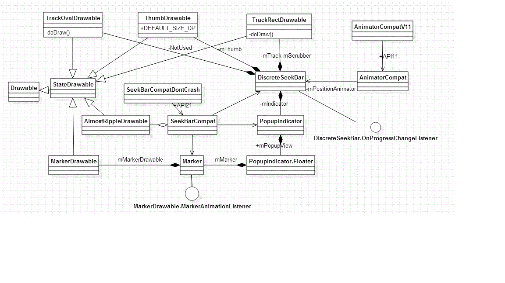

${项目名} 源码解析
====================================
> 本文为 [Android 开源项目源码解析](https://github.com/android-cn/android-open-project-analysis) 中 DiscreteSeekBar 部分  
> 项目地址：[anderWeb/discreteSeekBar](https://github.com/AnderWeb/discreteSeekBar)，分析的版本：[f54f0cd6](https://github.com/AnderWeb/discreteSeekBar/commit/f54f0cd64cd33da9effe9103d80bcc408178d171 "Commit id is f54f0cd64cd33da9effe9103d80bcc408178d171")，Demo 地址：[discrete-seek-bar-demo](https://github.com/aosp-exchange-group/android-open-project-demo/tree/master/discrete-seek-bar-demo)    
> 分析者：[wangeason](https://github.com/wangeason})，分析状态：已完成，校对者：[Trinea](https://github.com/trinea)，校对状态：未开始   

 

##1. 功能介绍  

DiscreteSeekBar实现了类似Material design风格的Discrete Slider。DiscreteSeekBar可以在2.1以上的应用中使用，可以直接在xml中配置，使用方法类似SeekBar，很简单。

可以在xml中配置显示的格式，也可以在代码中自定义显示的数字或者指定显示字符。

##2. 详细设计

###2.1 类关系图

###2.2 类详细介绍
类及其主要函数功能介绍、核心功能流程图，流程图可使用 [Google Drawing](https://docs.google.com/drawings)、[Visio](http://products.office.com/en-us/visio/flowchart-software)、[StarUML](http://staruml.io/)。  
####2.2.1 public abstract class StateDrawable extends Drawable
A drawable that changes it's Paint color depending on the Drawable State

根据状态切换Drawable的颜色

private boolean updateTint(int[] state) called by @Override setState(int[] stateSet)
被子类调用，比较应该显示的颜色是否是当前颜色，若是，返回false； 若否，invalidate并返回true

####2.2.2 public class AlmostRippleDrawable extends StateDrawable implements Animatable

当API<21时，点击Thumb时，产生Ripple效果

####2.2.3 public class MarkerDrawable extends StateDrawable implements Animatable

<li>此类功能

Animates from a circle shape to a "marker" shape just using a RoundRect

从圆形动画变换到Marker的形状

Animates color change from the normal state color to the pressed state color

从圆形的颜色变换到Marker的颜色（即为按下的颜色）

<li>private void computePath(Rect bounds)
这个Marker实际是用path画了一个3个圆角，一个直角的正方形, 再用Matrix调整它的角度和相对位置。 把这个动画的完成度作为入参来调整这个图形，完成从圆形到marker的变化。

<li>public void animateToPressed() called in Marker.class

动画变换到marker，动画完成时，调用打开完成的接口

MarkerAnimationListener.onOpeningComplete

<li>public void animateToNormal() called in Marker.class

动画变换到关闭状态,动画完成时，调用关闭完成的接口MarkerAnimationListener.onClosingComplete

<li>private void updateAnimation(float factor) 

根据开始动画的时间和动画的方向计算动画完成的完成度，并调用computePath画marker

<li>private static int blendColors(int color1, int color2, float factor)

根据设置的开始和结束颜色，还有动画完成度，调出当前颜色，注意：这里的factor和updateAnimation中的factor不一样，已经是计算结果了。

####2.2.4 public class ThumbDrawable extends StateDrawable implements Animatable

seekBar上的圆形按钮，在按下以后调用animateToPtessed,100ms以后不会再绘制，直到再次调用animateToNormal，因为按下以后会绘制marker。 这里有个疑问为什么要在100ms以后，作者的解释是：This special delay is meant to help avoiding frame glitches while the Marker is added to the Window。 这100ms用来绘制Marker，避免同时绘制Thumb出现掉帧，感觉卡顿。

####2.2.5 public class TrackRectDrawable extends StateDrawable
绘制矩形，用来画ProgressBar和Track

####2.2.6 public class TrackOvalDrawable extends StateDrawable
没有调用和实现，应该是作者准备用来做圆形seekBar的。

####2.2.7 public class Marker extends ViewGroup implements MarkerDrawable.MarkerAnimationListener
<Li> public void resetSizes(String maxValue)

这个方法根据seekbar的最大值来确定marker的宽度，如果有负数的时候会出现bug，如果改成最大和最小值中的最大位数就不会可以在显示整数的时候避免这个问题。

<Li> public void animateOpen()

在onAttachedToWindow()被调用，动画打开Marker。

<Li> public void animateClose()

在PopupIndicator中被调用，动画关闭Marker，并设置为INVISIBLE.

<Li> public void setColors(int startColor, int endColor)

在PopupIndicator中被调用，设置MarkerDrawable的动画开始和结束时的颜色。

<Li> MarkerAnimationListener的实现

这里实际是只实现了onOpeningComplete时，设置显示Marker上的文本。 然后让PopupIndicator.Floater来实现其余部分

####2.2.8 private class Floater extends FrameLayout implements MarkerDrawable.MarkerAnimationListener

用来实现Marker的滑动

<Li>public void setFloatOffset(int x)

通过设置childview的Marker的左右偏移，来实现Floater的滑动，被PopupIndicator调用，实现Marker的滑动。

<Li>MarkerAnimationListener的实现

除了实现了DiscreteSeekBar中的mFloaterListener外，还在onClosingComplete中，把PopupIndicator中的Floater删除了

####2.2.9 public class PopupIndicator

manage Floater

<Li> public void updateSizes(String maxValue)

先删除Floater的View，然后设置Marker的最大值

<Li> public void setListener(MarkerDrawable.MarkerAnimationListener listener)

DiscreteSeekBar通过这个方法设置监听

<Li> private void measureFloater()

通过调用Floater的measure方法，设置其宽度为全屏,作者说这里有待改进

<Li> public void setValue(CharSequence value)

设置Marker的TextView

<Li> public void showIndicator(View parent, Rect touchBounds)

在指定位置显示出Indicator，Rect touchBounds为DiscreteSeekBar传入的Thumb的Bounds

<Li> private WindowManager.LayoutParams createPopupLayout(IBinder token)
<Li> private void updateLayoutParamsForPosiion(View anchor, WindowManager.LayoutParams p, int yOffset)

获取和编辑Floater的layoutParams

<Li> private void invokePopup(WindowManager.LayoutParams p)

添加Floater并，动画打开Marker

####2.2.10 public class DiscreteSeekBar extends View

<Li> public interface OnProgressChangeListener

用户实现，监听DiscreteSeekBar数值变化

<Li> public static abstract class NumericTransformer

其中抽象方法public abstract int transform(int value)根据DiscreteSeekBar的数值value，返回要在Marker中显示的数值，而且这个返回的数值会被设置的正则Formatter转换，默认的Formatter是DEFAULT_FORMATTER = "%d"，这个Formatter可以通过setIndicatorFormatter方法或者xml设置

另外另个方法可以设置Marker中显示的为根据value取得的字符，并且这个字符不会被Formatter转换

<Li> public void setNumericTransformer

设置Transformer，并刷新Marker上的显示

<Li> public void setMax(int max) 
<Li> public void setMin(int min)

这另个方法用来设置DiscreteSeekBar的最大最小值，并且刷新如果用按键控制SeekBar时的步进值。

<Li> public void setProgress(int progress) 

设置进度，其中检查了这个这个progress，使它过大和过小时都能正常运行

<Li> private void notifyProgress(int value, boolean fromUser)
调用 onProgressChanged接口，并且调用一个空的方法onValueChanged，这个方法的左右是，当有DiscreteSeekBar的继承类的时候，可以复写onValueChanged，而不必实现onPregressChanged。

<Li> private void notifyBubble(boolean open)

作用类似于 onValueChanged，只不过这个监听的是 Floater、Marker的消失和显示

<Li> private void updateFromDrawableState()

根据Drawable的状态来设置Marker的动画。这个方法被onLayout和drawableStateChanged调用。

<Li> private boolean startDragging(MotionEvent ev, boolean ignoreTrackIfInScrollContainer)
<Li> private void stopDragging() 
<Li> private void updateDragging(MotionEvent ev)

顾名思义，这个3个方法就是拖动Thumb的时候被调用的。 都在public boolean onKeyDown(int keyCode, KeyEvent event)被调用。

<Li> private void updateThumbPos(int posX)

根据滑动的拖动的位置绘制进度条（mScruber）和Thumb

##3. 杂谈

1.  Marker的宽度的设定太死板，当设定的min值得长度大于max值得时候min值就没法完整显示了。
2.  进度条上没有标记点，可以考虑在背景trackBar上设置一些点，这些点着重突出出来，在scruber滑过这些点的时候，出一些效果。这个我准备完成以后再和大家分享。

